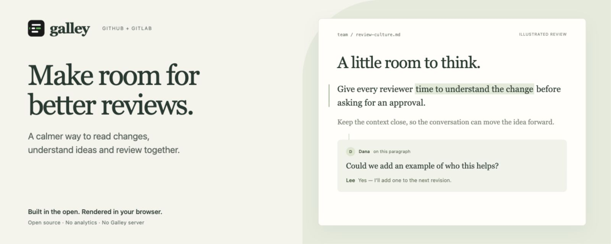

# Galley

[](https://github.com/m9rc1n/galley/actions/workflows/ci.yml)
[](https://codecov.io/gh/m9rc1n/galley)
[](LICENSE)

**Make room for better reviews.**



Galley is a free, open-source browser extension for reviewing Markdown in GitHub pull requests and GitLab merge requests. Read the document with its changes in place, keep the context nearby, and join the conversation through your team's existing review tools.

## Why we're building this

A good review starts with understanding. RFCs, decisions and runbooks ask people to consider someone else's thinking, often at the end of an already busy day. Reading raw Markdown, piecing together scattered context and chasing comments all take attention away from that work.

**Our mission is to make reviewing clearer, calmer and easier on the people who do it.** Galley gives ideas room to be read carefully and discussed thoughtfully. We want to reduce the everyday friction of a review while keeping the team, the document and its history together.

## What you can count on

- **Built in the open.** Galley is [MIT-licensed](LICENSE). Its source, [permissions and data handling](PRIVACY.md), and [known limitations](#limitations) are available to inspect. Questions and improvements belong in the open, too.
- **Private by default.** Documents and diagrams render in your browser. Galley has no backend, analytics, advertising or telemetry. Images from other websites wait for your permission to load.
- **Your existing workflow.** Comments are ordinary GitHub or GitLab review comments. Teammates can read them without installing Galley, and your review stays with the repository.
- **Care for the reviewer.** Comfortable type, quiet change markers, nearby context and keyboard controls help you keep your attention on the ideas. You choose when to comment and what to share.

Reading fetches files and threads from your code host; posting sends your comment back to that review. Repository content is never uploaded to a Galley service. Private GitHub repositories require an access token, stored on your device. The [privacy policy](PRIVACY.md) explains these boundaries in detail.

## From change to conversation

| What you need | How Galley helps |
| --- | --- |
| Understand the change | Read rendered documents in one continuous stream. Changed paragraphs appear first; reveal nearby unchanged content whenever you need it. |
| See what matters | Edits appear in the text. Changed link and image destinations are called out; re-wrapped prose produces no noise. Tables are compared cell by cell. |
| Discuss the idea | Existing threads appear beside their paragraphs. Select text or choose a paragraph to post a comment anchored to its source. |
| Finish the review | Render Mermaid diagrams, read syntax-coloured code, optionally include source files after documents, and track files you've viewed. |


Light, sepia and dark themes, serif or sans text, adjustable type size and a clean reading mode let you make the reader comfortable for you.

## Try it

**Without installing anything:** `npm install && npm run demo`, then open http://localhost:4173. The demo runs the real reader on a sample merge request.

**From the Chrome Web Store:** coming soon; until then, install from a [release](https://github.com/m9rc1n/galley/releases) (download `galley-chrome-<version>.zip`, unzip it, then **Load unpacked** on `chrome://extensions`) or build it yourself (below).

**In your own Chrome, as a developer:** see [Develop in your own Chrome](#develop-in-your-own-chrome) below.

**As a plain unpacked extension:**

```bash
git clone https://github.com/m9rc1n/galley.git
cd galley
npm install
npm run build
```

- Chrome, Edge, Brave, Arc: open `chrome://extensions`, turn on **Developer mode**, choose **Load unpacked** and pick `dist/chrome`.
- Firefox: open `about:debugging#/runtime/this-firefox`, choose **Load Temporary Add-on** and pick `dist/firefox/manifest.json`.

`npm run zip` writes store-ready archives to `dist/`.

## Using it

Open a pull or merge request and press **Read** in the bottom-right corner. The number counts changed Markdown documents, or supported source files when there are no documents. Documents appear first; **Reading settings → Code files** appends changed source and configuration files to the same stream. The option is off by default and remembered for future reviews. Code contents are fetched only when enabled, with old/new line numbers, additions and deletions, and controls to reveal unchanged lines. Binary files and unknown file types are excluded; source files over 500,000 characters show a link back to the platform diff.

| Key | Action |
| --- | --- |
| <kbd>J</kbd> / <kbd>K</kbd> | Next / previous change |
| <kbd>]</kbd> / <kbd>[</kbd> | Next / previous document |
| <kbd>R</kbd> | Comment on the paragraph in focus |
| <kbd>V</kbd> | Mark the current document as viewed |
| <kbd>C</kbd> | Switch between Changes and Clean |
| <kbd>+</kbd> / <kbd>−</kbd> | Text size |
| <kbd>⌘</kbd>/<kbd>Ctrl</kbd> + <kbd>Enter</kbd> | Post the comment in the focused composer |
| <kbd>Esc</kbd> | Close the innermost layer: menu, comment chip, empty composer, then the reader |

The top bar stays quiet: the current document (a status dot, its name and position), change navigation, a **Viewed** toggle and **Reading settings**. The document menu lists every changed file with its folder, status and viewed progress, under the pull request title. Reading settings opens as a small sheet (a bottom sheet on phones) with Changes/Clean, the paragraph filter, code files, external images, theme (auto, light, sepia, dark), serif or sans text and text size. Long documents get a contents rail on the right, with a dot next to every section that changed. A draft is never discarded by Esc; only **Cancel** discards it.

### GitLab (gitlab.com and self-managed)

Nothing to configure: Galley reads the merge request with your signed-in session. On a self-managed instance, click the Galley icon in the browser toolbar and choose **Enable on git.example.com**; the extension then gets access to that one domain. Nested groups and instances installed under a sub-path work.

### GitHub (github.com and Enterprise Server)

Public repositories work without setup. GitHub allows 60 API requests per hour without a token. Galley uses three requests for a pull request with up to 100 files, additional requests for each page of files, and one comparison request when a patch is omitted. Posting a comment also checks that the reviewed version is still current.

Private repositories need a token, because GitHub's API does not accept the browser session. Create a [fine-grained personal access token](https://github.com/settings/personal-access-tokens/new) with read-only **Contents** and **Pull requests** access to the repositories you review, then paste it into the Galley popup. To comment, give the token **Pull requests: read and write** access; **Contents** can remain read-only. Public reading still works without a token.

The token is kept in Galley's own extension storage, which web pages (including GitHub's) cannot read. Requests that need it are made by Galley's background worker, never from the page, and only for the few API calls the reader uses on the pull request open in that tab. Tokens are only saved and sent for https sites. For GitHub Enterprise Server, enable the site in the popup and save a token for it there; Galley first checks that the site answers like a GitHub Enterprise Server.

### Code

Code blocks and source files are shown one line per block: long lines wrap under their own indentation instead of disappearing past the edge, so nothing needs sideways scrolling. Syntax colours come from highlight.js, bundled with the extension and loaded only when code is on screen; both versions of a file are highlighted as a whole, so comments and strings that span lines colour correctly. Changed lines get a faint tint and a coloured edge rather than a full fill, and a file that is entirely new or deleted is announced once instead of tinting every line. Source files are titled by their path, with their language in the byline.

### Diagrams

Fenced `mermaid` blocks render as diagrams using an engine bundled with the extension and loaded only when needed. Edited diagrams show **Before** and **After** versions; Clean mode shows the new version. **View source** reveals the original Mermaid code. Clicking either version targets the matching source fence for comments. Invalid or unsupported diagrams keep their readable source. Rendering happens locally, with no CDN or external diagram images/icon packs. Diagrams are limited to 20,000 source characters and 300 edges.

### Commenting

Nothing follows your scrolling: you choose what to comment on. Select text and press the **Comment** chip that appears above it, use the comment button beside a paragraph in the left margin, or press <kbd>R</kbd>. On touch screens, tap a paragraph. The paragraph gets a neutral tint (a selection stays highlighted) and the composer opens with two columns: on the left the file, version, source lines and the exact quote that will be attached; on the right your comment. Selected text is quoted exactly; the anchor covers its containing Markdown paragraph(s), so rendering and line wrapping do not guess at sentence-level source positions. Removed paragraphs and old diagram versions target the old version. Source-file comments target the selected line or line range, preserving the quoted code. Selections crossing files or mixing old and new text are rejected. Choosing another paragraph while drafting keeps the draft.

Comments use the platform's own review APIs: [GitHub review comments](https://docs.github.com/en/rest/pulls/comments#create-a-review-comment-for-a-pull-request) and [GitLab discussions](https://docs.gitlab.com/api/discussions/#create-a-new-thread-in-the-merge-request-diff). Other reviewers see ordinary platform comments without Galley. Existing review threads load with the review and sit beside their paragraphs: authors, times and the comment text, rendered through the same sanitiser as documents. File comments and threads whose line is gone are listed under the document's byline. A posted comment joins the margin at once.

GitLab uses your signed-in session and the page's CSRF token. GitHub requires a token with **Pull requests: read and write**. When the source range is outside the available diff (including omitted or truncated patches), the composer explicitly identifies a quoted GitHub file comment or a GitLab discussion instead of an inline comment. Posting checks the current review revision first. A failed post keeps the draft, and writes are never retried automatically; if a network failure leaves the result uncertain, check the platform before posting again.

Use **Mark viewed** in the top bar to track your review without collapsing the file. The Files menu shows viewed progress and a check beside completed files. With a GitHub token, Galley reads and updates GitHub's native [Viewed status](https://docs.github.com/en/graphql/reference/pulls#markfileasviewed), including unmarking. These requests check that the review revision is still current; failures leave the previous flag intact and show an error. Without a GitHub token, and on GitLab, progress stays in this browser. Local progress uses a fingerprint of that file's old and new contents, so it resets when the file changes while unrelated file updates preserve it. The button tooltip identifies where progress is saved.

The demo saves comments in browser session storage and Viewed progress locally, and never sends them to GitHub or GitLab.

## How it works

1. A content script recognises pull/merge request pages, including in-app navigation, and lists changed documents and supported source files through the platform's REST API.
2. It loads both versions of each document, and each source file when code files are enabled.
   - GitLab: the raw files at the merge base and at the head commit.
   - GitHub: the head file through the same-origin raw URL. The base version is rebuilt by reversing the pull request's patch, and fetched at the merge base only when GitHub omits the patch.
3. Both versions are parsed with markdown-it: GFM tables, task lists, footnotes, alerts (`> [!NOTE]`) and front matter. Every leaf block (paragraph, list item, heading, table, code block) remembers its source lines.
4. A block diff matches the two documents. Prose is compared by whitespace-normalised text plus its resolved link and image destinations; code and raw HTML are compared exactly. Edited blocks are paired by word similarity, and inside paired blocks a word diff marks what changed, using `Intl.Segmenter` tokens and a clean-up pass so rewrites read as phrases rather than confetti. Every diff has a work limit, so hostile input degrades to "replaced" instead of freezing the tab.
5. The result is sanitised with DOMPurify and shown in a shadow-DOM overlay, so the page's styles and the reader's never mix. Changed source lines that render nowhere (HTML comments, link definitions) are counted and linked to the platform diff.

| Path | What it is |
| --- | --- |
| `src/content/main.ts` | Content script: page detection, the Read button, single-page navigation |
| `src/platforms/` | GitHub and GitLab adapters, page detection, fetch helpers |
| `src/core/` | Markdown parsing into blocks, block diff, word diff, DOM highlighting, patch reversal |
| `src/ui/` | Reader overlay, its stylesheet, rendering pipeline, settings |
| `src/popup/` | Toolbar popup: enable self-hosted sites, GitHub token |
| `src/background/` | Background worker: holds the GitHub token and makes the token-bearing API calls |
| `demo/` | Sample merge request for trying the reader without the extension |
| `src/testing/` | Helpers shared by the unit tests (never shipped) |
| `src/**/*.test.ts` | Unit tests, next to the code they cover |
| `e2e/` | Browser checks of the reader, run in Chrome against the demo |
| `lint/` | Custom lint rules for [Biome](https://biomejs.dev) |

## Privacy and security

- No server, no analytics. Galley itself only contacts the GitHub or GitLab instance you are on. On GitHub.com that includes `api.github.com`, and the `raw.githubusercontent.com` downloads that raw files redirect to.
- Markdown HTML is sanitised: no scripts, iframes, forms or inline styles. Source files are displayed as plain text. Mermaid SVGs are separately sanitised and displayed as inert images; rendering directives and external image/icon assets are disabled. Pull requests can come from forks.
- Raw HTML in a document cannot use Galley's own classes or attributes, so it cannot fake change markers, banners or block IDs.
- Documents cannot load anything by themselves. Images hosted on the review site load normally; images hosted elsewhere wait behind a **Load** button (or the **External images: Load** setting), so a pull request cannot track who reads it. Video, audio, `srcset`, `background` and external SVG references are removed.
- Changed link and image destinations are shown inline, and changes that render nowhere are counted, so a reviewer is not told "no visible changes" when something changed.
- The GitHub token never enters the page: it lives in extension storage that web pages cannot read, and only Galley's background worker sends it, for an allowlist of the reader's own API calls.
- Permissions: github.com and gitlab.com. Other domains only after you enable them in the popup. GitHub API calls are cross-origin requests that need no extra permission.

## Limitations

- Comments anchor to containing source blocks. Existing threads are shown, but replying and resolving happen on the platform for now.
- Platform-specific syntax renders approximately: GitLab's `[[_TOC_]]`, math and PlantUML diagrams appear as text or code, and `#123` / `@user` references are not linked.
- The whole pull/merge request is used; picking a commit range in the platform UI is not reflected.
- Paragraphs rewritten by more than 60% are shown as the old version removed and the new one added, not as word edits.
- Very large requests are listed up to 1,000 files on GitHub and 2,000 on GitLab.
- Tested in Chrome. The Firefox build has not been tried in Firefox yet; Safari is not packaged.

## Roadmap

We are building toward a complete, considerate review flow:

1. **Conversation in the margin.** Reply to and resolve the threads that the reader already shows beside their paragraphs.
2. **Review flow.** Approve or request changes from the reader.
3. **Richer rendering.** Math, issue and user references.
4. **Distribution.** Chrome Web Store and Firefox Add-ons listings.

## Publishing

[PUBLISHING.md](PUBLISHING.md) walks through the Chrome Web Store submission. What is already prepared:

- `npm run release` runs the tests and the type check, then builds `dist/galley-chrome-<version>.zip`. The zip includes `THIRD_PARTY_NOTICES.txt` with the licences of the bundled libraries.
- [`store/ARTWORK.md`](store/ARTWORK.md) explains the mission artwork and its reproducible templates.
- [`store/LISTING.md`](store/LISTING.md) has the listing copy, the privacy-practices answers (single purpose, permission justifications, data disclosures) and the reviewer test instructions.
- `npm run store-assets` renders the five 1280×800 screenshots, both promo tiles, the README hero and the store icon into `store/assets/`. Screenshots come from the real reader; the mission artwork is a typeset illustration.
- [`PRIVACY.md`](PRIVACY.md) is the privacy policy. `npm run privacy-page` turns it into `store/privacy-policy.html` for hosting.

## Develop in your own Chrome

```bash
npm install
npm run dev
```

Then, once: open `chrome://extensions`, turn on **Developer mode**, click **Load unpacked** and choose `dist/dev`.

- The dev build is called **Galley (dev)**. It has an orange icon and DEV badges, so it can sit next to the store version; turn the store version off while you develop.
- Leave `npm run dev` running. Every save rebuilds:
  - content script changes appear in the active GitHub or GitLab tab within a couple of seconds;
  - popup changes show the next time you open the popup;
  - manifest or dev-worker changes need one click on the reload icon of Galley (dev) in `chrome://extensions`.
- Source maps are included, so DevTools shows the TypeScript sources.
- The dev build keeps its own settings and GitHub token, separate from the store version.
- `npm run dev:zip` makes a dev build with the same name and badges that works without `npm run dev` (no live reload), plus a zip of it.

## Development

```bash
npm run dev        # dev build in dist/dev with live reload (see above)
npm run dev:zip    # one-off dev build that works without the dev server (dist/dev-standalone + zip)
npm run demo       # build and serve the demo on http://localhost:4173
npm test           # unit tests (Vitest), one project per folder
npm run test:watch # unit tests, re-running as you edit
npm run test:coverage # unit tests with coverage and the per-folder thresholds
npm run test:e2e   # builds the demo and runs the browser checks (Chrome; CHROME_PATH supported)
npm run lint       # Biome; npm run lint:fix applies the safe fixes
npm run typecheck  # TypeScript, no emit
npm run check      # typecheck, lint and unit tests: what a pull request needs to pass
npm run icons      # redraw the toolbar icons
npm run release    # tests, type check, store-ready zips, privacy page
npm run store-assets  # real screenshots, mission artwork and README hero (needs Chrome)
npm run artwork       # local artwork and README preview on http://localhost:4180
```

Requires Node 22.12 or newer (22.12+, 24 or 26+). Tests, coverage and lint rules are described in [CONTRIBUTING.md](CONTRIBUTING.md#tests-and-lint).

## Contributing

Tell us what makes reviews harder for you: a long document, missing context, an accessibility barrier, or a conversation that is difficult to follow. [Issues](https://github.com/m9rc1n/galley/issues) and pull requests help shape the project; see [CONTRIBUTING.md](CONTRIBUTING.md). Security reports go through [SECURITY.md](SECURITY.md).

## License

[MIT](LICENSE) © Marcin Urbanski. The licences of the bundled libraries are listed in `THIRD_PARTY_NOTICES.txt` inside every build.
