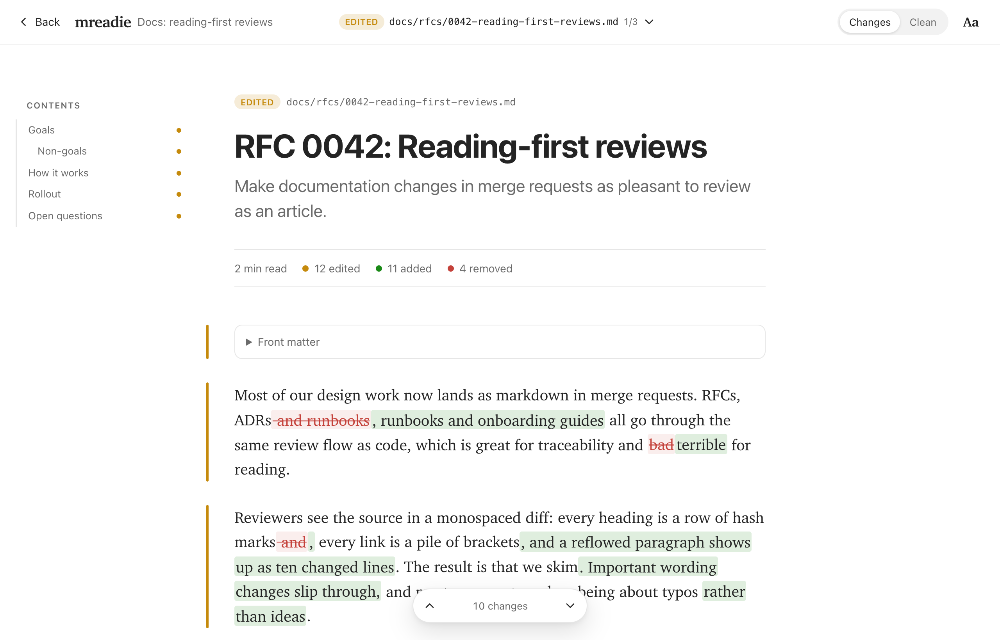
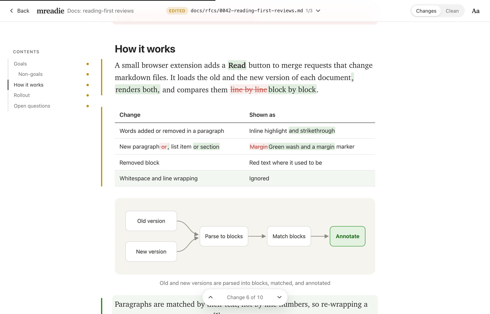
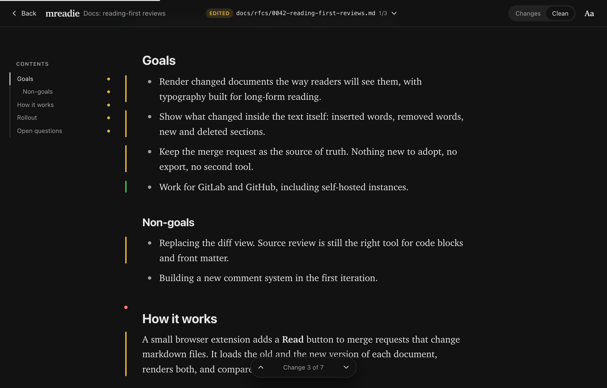

# mreadie

Read markdown changes in GitHub pull requests and GitLab merge requests like an article, not like a diff.



RFCs, ADRs, runbooks and guides are reviewed in the same monospaced diff as code, so reviewers render the markdown in their heads and skim. mreadie adds a **Read** button to every pull/merge request that changes markdown files. Each changed document opens as a typeset article (a 680px serif column with Medium-style rhythm) and the changes are marked inside the text:

- inserted words are highlighted, removed words struck through;
- new paragraphs, list items and sections get a green wash, removed ones stay in place in red;
- tables are compared cell by cell and code blocks line by line;
- re-wrapping a paragraph is not a change;
- **Clean** mode drops the markup and keeps quiet margin markers, so you read the new version as it will be published.

| Changes | Clean, dark |
| --- | --- |
|  |  |

Version 0.1 is read-only: comments still go in the platform's diff view (see [Roadmap](#roadmap)).

## Try it

**Without installing anything:** `npm install && npm run demo`, then open http://localhost:4173. The demo runs the real reader on a sample merge request.

**From the Chrome Web Store:** coming soon; until then, install from a [release](https://github.com/m9rc1n/mreadie/releases) (download `mreadie-chrome-<version>.zip`, unzip it, then **Load unpacked** on `chrome://extensions`) or build it yourself (below).

**In your own Chrome, as a developer:** see [Develop in your own Chrome](#develop-in-your-own-chrome) below.

**As a plain unpacked extension:**

```bash
git clone https://github.com/m9rc1n/mreadie.git
cd mreadie
npm install
npm run build
```

- Chrome, Edge, Brave, Arc: open `chrome://extensions`, turn on **Developer mode**, choose **Load unpacked** and pick `dist/chrome`.
- Firefox: open `about:debugging#/runtime/this-firefox`, choose **Load Temporary Add-on** and pick `dist/firefox/manifest.json`.

`npm run zip` writes store-ready archives to `dist/`.

## Using it

Open a pull or merge request that changes `.md` files and press **Read** in the bottom-right corner. The number on the button is how many markdown documents changed.

| Key | Action |
| --- | --- |
| <kbd>J</kbd> / <kbd>K</kbd> | Next / previous change |
| <kbd>]</kbd> / <kbd>[</kbd> | Next / previous document |
| <kbd>C</kbd> | Switch between Changes and Clean |
| <kbd>+</kbd> / <kbd>−</kbd> | Text size |
| <kbd>Esc</kbd> | Back to the diff |

The **Aa** menu has the theme (auto, light, sepia, dark), serif or sans text, and text size. Long documents get a contents rail on wide screens, with a dot next to every section that changed.

### GitLab (gitlab.com and self-managed)

Nothing to configure: mreadie reads the merge request with your signed-in session. On a self-managed instance, click the mreadie icon in the browser toolbar and choose **Enable on git.example.com**; the extension then gets access to that one domain. Nested groups and instances installed under a sub-path work.

### GitHub (github.com and Enterprise Server)

Public repositories work without setup. GitHub allows 60 API requests per hour without a token; mreadie uses one per pull request, plus two more when a file's diff is too large for the API to include.

Private repositories need a token, because GitHub's API does not accept the browser session. Create a [fine-grained personal access token](https://github.com/settings/personal-access-tokens/new) with read-only **Contents** and **Pull requests** access to the repositories you review, then paste it into the mreadie popup. The token stays in the browser's extension storage and is only sent to the GitHub API. For GitHub Enterprise Server, enable the site in the popup and save a token for it there.

## How it works

1. A content script recognises pull/merge request pages, including in-app navigation, and lists the changed markdown files through the platform's REST API.
2. It loads both versions of each document.
   - GitLab: the raw files at the merge base and at the head commit.
   - GitHub: the head file through the same-origin raw URL. The base version is rebuilt by reversing the pull request's patch, and fetched at the merge base only when GitHub omits the patch.
3. Both versions are parsed with markdown-it: GFM tables, task lists, footnotes, alerts (`> [!NOTE]`) and front matter. Every leaf block (paragraph, list item, heading, table, code block) remembers its source lines.
4. A block diff matches the two documents. Blocks are compared by whitespace-normalised text, then edited blocks are paired by word similarity. Inside paired blocks, a word diff marks what changed, using `Intl.Segmenter` tokens and a clean-up pass so rewrites read as phrases rather than confetti.
5. The result is sanitised with DOMPurify and shown in a shadow-DOM overlay, so the page's styles and the reader's never mix.

| Path | What it is |
| --- | --- |
| `src/content/main.ts` | Content script: page detection, the Read button, single-page navigation |
| `src/platforms/` | GitHub and GitLab adapters, page detection, fetch helpers |
| `src/core/` | Markdown parsing into blocks, block diff, word diff, DOM highlighting, patch reversal |
| `src/ui/` | Reader overlay, its stylesheet, rendering pipeline, settings |
| `src/popup/` | Toolbar popup: enable self-hosted sites, GitHub token |
| `demo/` | Sample merge request for trying the reader without the extension |
| `test/` | Unit tests (`node --test`) |

## Privacy and security

- No server, no analytics. Requests go only to the GitHub or GitLab instance you are on, plus `api.github.com` and `raw.githubusercontent.com` for GitHub.
- Everything rendered is sanitised: no scripts, iframes, forms or inline styles. Pull requests can come from forks.
- Images inside documents load from wherever they are hosted. GitHub's own preview proxies external images; mreadie does not.
- Permissions: github.com, gitlab.com and the two GitHub hosts above. Other domains only after you enable them in the popup.

## Limitations

- Read-only: no commenting from the reader yet.
- Platform-specific syntax renders approximately: GitLab's `[[_TOC_]]`, math and Mermaid/PlantUML diagrams appear as text or code, and `#123` / `@user` references are not linked.
- The whole pull/merge request is used; picking a commit range in the platform UI is not reflected.
- Paragraphs rewritten by more than 60% are shown as the old version removed and the new one added, not as word edits.
- Very large requests are listed up to 1,000 files on GitHub and 2,000 on GitLab.
- Tested in Chrome. The Firefox build has not been tried in Firefox yet; Safari is not packaged.

## Roadmap

Toward changing how we review merge requests together:

1. **Comment from the reader.** Select a sentence, write, and it posts as a normal review comment on the source lines behind it. Teammates without the extension see ordinary comments. GitLab accepts comments on any line; GitHub's API still only accepts lines inside the diff, so comments elsewhere become file-level comments that quote the sentence.
2. **Threads in the margin.** Show existing review threads next to the paragraphs they discuss, and resolve them from the reader.
3. **Review flow.** Mark documents as viewed (synced with the platform), then approve or request changes from the reader.
4. **Richer rendering.** Mermaid diagrams, math, issue and user references.
5. **Distribution.** Chrome Web Store and Firefox Add-ons listings.

## Publishing

[PUBLISHING.md](PUBLISHING.md) walks through the Chrome Web Store submission. What is already prepared:

- `npm run release` runs the tests and the type check, then builds `dist/mreadie-chrome-<version>.zip`. The zip includes `THIRD_PARTY_NOTICES.txt` with the licences of the bundled libraries.
- [`store/LISTING.md`](store/LISTING.md) has the listing copy, the privacy-practices answers (single purpose, permission justifications, data disclosures) and the reviewer test instructions.
- `npm run store-assets` renders the five 1280×800 screenshots, both promo tiles and the store icon into `store/assets/`, from the real reader.
- [`PRIVACY.md`](PRIVACY.md) is the privacy policy. `npm run privacy-page` turns it into `store/privacy-policy.html` for hosting.

## Develop in your own Chrome

```bash
npm install
npm run dev
```

Then, once: open `chrome://extensions`, turn on **Developer mode**, click **Load unpacked** and choose `dist/dev`.

- The dev build is called **mreadie (dev)**. It has an orange icon and DEV badges, so it can sit next to the store version; turn the store version off while you develop.
- Leave `npm run dev` running. Every save rebuilds:
  - content script changes appear in the active GitHub or GitLab tab within a couple of seconds;
  - popup changes show the next time you open the popup;
  - manifest or dev-worker changes need one click on the reload icon of mreadie (dev) in `chrome://extensions`.
- Source maps are included, so DevTools shows the TypeScript sources.
- The dev build keeps its own settings and GitHub token, separate from the store version.

## Development

```bash
npm run dev        # dev build in dist/dev with live reload (see above)
npm run demo       # build and serve the demo on http://localhost:4173
npm test           # unit tests
npm run typecheck  # TypeScript, no emit
npm run icons      # redraw the toolbar icons
npm run release    # tests, type check, store-ready zips, privacy page
npm run store-assets  # store screenshots and promo tiles (needs Chrome)
```

Requires Node 22.6 or newer (the tests run TypeScript directly).

## Contributing

Issues and pull requests are welcome; see [CONTRIBUTING.md](CONTRIBUTING.md). Security reports go through [SECURITY.md](SECURITY.md).

## License

[MIT](LICENSE) © Marcin Urbanski. The licences of the bundled libraries are listed in `THIRD_PARTY_NOTICES.txt` inside every build.
