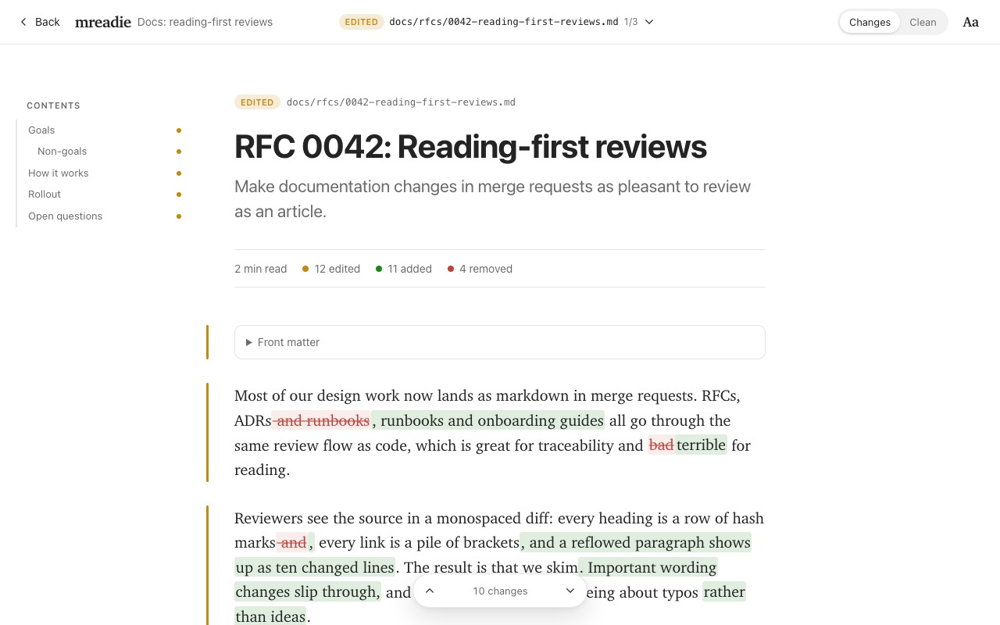
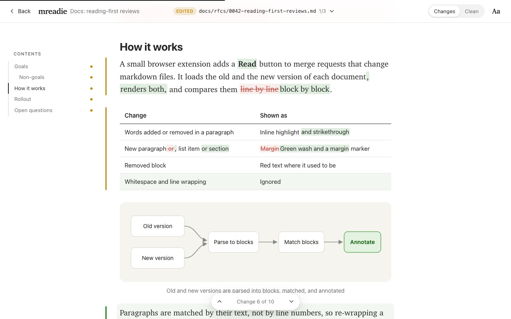
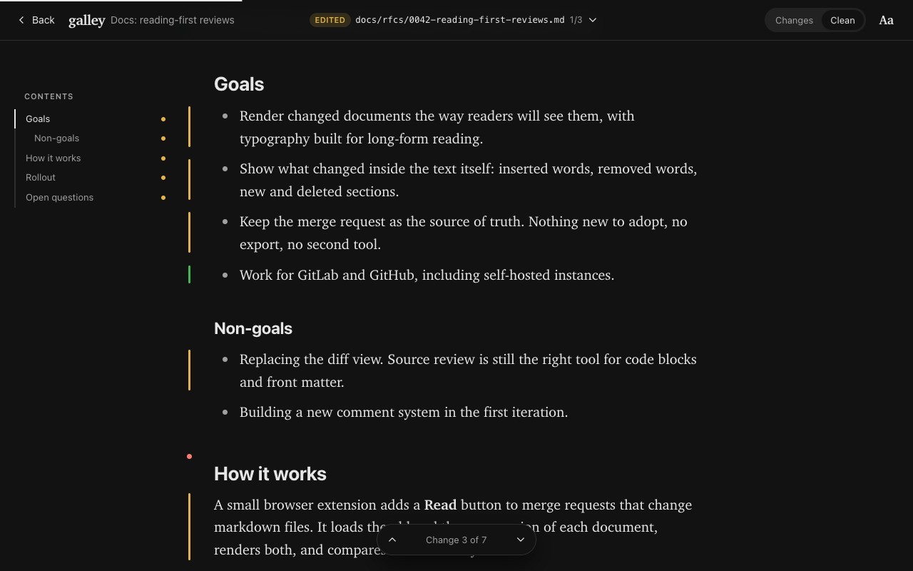

# Galley

Read markdown changes in GitHub pull requests and GitLab merge requests like an article, not like a diff.



RFCs, ADRs, runbooks and guides are reviewed in the same monospaced diff as code, so reviewers render the markdown in their heads and skim. Galley adds a **Read** button to every pull/merge request that changes markdown files. Each changed document opens as a typeset article (a 680px serif column with Medium-style rhythm) and the changes are marked inside the text:

- inserted words are highlighted, removed words struck through;
- new paragraphs, list items and sections get a green wash, removed ones stay in place in red;
- tables are compared cell by cell and code blocks line by line;
- re-wrapping a paragraph is not a change;
- **Clean** mode drops the markup and keeps quiet margin markers, so you read the new version as it will be published.

| Changes | Clean, dark |
| --- | --- |
|  |  |

The reader opens all changed documents in one continuous stream, showing changed paragraphs by default. Each hidden stretch has an arrow control to expand or collapse nearby unchanged content; **Entire files** restores every paragraph. A small neutral pointer in the change gutter follows the reading line. Clicking or selecting text pins that line and reveals a softly shaded surface with space around the comment target; source files keep that surface around the code panel. Text stays in place, and releasing the target removes the surface. Click a paragraph or select a phrase to pin a comment target, then write in the bottom composer and post an ordinary GitHub or GitLab review comment.

## Try it

**Without installing anything:** `npm install && npm run demo`, then open http://localhost:4173. The demo runs the real reader on a sample merge request.

**From the Chrome Web Store:** coming soon; until then, install from a [release](https://github.com/m9rc1n/galley/releases) (download `galley-chrome-<version>.zip`, unzip it, then **Load unpacked** on `chrome://extensions`) or build it yourself (below).

**In your own Chrome, as a developer:** see [Develop in your own Chrome](#develop-in-your-own-chrome) below.

**As a plain unpacked extension:**

```bash
git clone https://github.com/m9rc1n/galley.git
cd galley
npm install
npm run build
```

- Chrome, Edge, Brave, Arc: open `chrome://extensions`, turn on **Developer mode**, choose **Load unpacked** and pick `dist/chrome`.
- Firefox: open `about:debugging#/runtime/this-firefox`, choose **Load Temporary Add-on** and pick `dist/firefox/manifest.json`.

`npm run zip` writes store-ready archives to `dist/`.

## Using it

Open a pull or merge request and press **Read** in the bottom-right corner. The number counts changed Markdown documents, or supported source files when there are no documents. Documents appear first; **Reading settings → Include code files after documents** appends changed source and configuration files to the same stream. The option is off by default and remembered for future reviews. Code contents are fetched only when enabled, with old/new line numbers, additions and deletions, and controls to reveal unchanged lines. Binary files and unknown file types are excluded; source files over 500,000 characters show a link back to the platform diff.

| Key | Action |
| --- | --- |
| <kbd>J</kbd> / <kbd>K</kbd> | Next / previous change |
| <kbd>]</kbd> / <kbd>[</kbd> | Next / previous document |
| <kbd>C</kbd> | Switch between Changes and Clean |
| <kbd>+</kbd> / <kbd>−</kbd> | Text size |
| <kbd>⌘</kbd>/<kbd>Ctrl</kbd> + <kbd>Enter</kbd> | Post the comment in the focused composer |
| <kbd>Esc</kbd> | Close the reader |

The **Reading settings** button opens a drawer with the code-files option, paragraph filter, Changes/Clean highlighting, theme (auto, light, sepia, dark), serif or sans text, and text size. Esc closes the drawer first, then the reader. The sticky top bar shows the current file path and Viewed action, updating as you scroll between files. The **×** button closes the reader (its tooltip shows **Esc**). File-menu entries and document shortcuts scroll to the selected file without replacing the others. **Changes/Clean** controls the change markup independently of the paragraph filter. Long documents get a contents rail on wide screens, with a dot next to every section that changed.

### GitLab (gitlab.com and self-managed)

Nothing to configure: Galley reads the merge request with your signed-in session. On a self-managed instance, click the Galley icon in the browser toolbar and choose **Enable on git.example.com**; the extension then gets access to that one domain. Nested groups and instances installed under a sub-path work.

### GitHub (github.com and Enterprise Server)

Public repositories work without setup. GitHub allows 60 API requests per hour without a token. Galley uses three requests for a pull request with up to 100 files, additional requests for each page of files, and one comparison request when a patch is omitted. Posting a comment also checks that the reviewed version is still current.

Private repositories need a token, because GitHub's API does not accept the browser session. Create a [fine-grained personal access token](https://github.com/settings/personal-access-tokens/new) with read-only **Contents** and **Pull requests** access to the repositories you review, then paste it into the Galley popup. To comment, give the token **Pull requests: read and write** access; **Contents** can remain read-only. Public reading still works without a token. The token stays in the browser's extension storage and is only sent to the GitHub API. For GitHub Enterprise Server, enable the site in the popup and save a token for it there.

### Diagrams

Fenced `mermaid` blocks render as diagrams using an engine bundled with the extension and loaded only when needed. Edited diagrams show **Before** and **After** versions; Clean mode shows the new version. **View source** reveals the original Mermaid code. Clicking either version targets the matching source fence for comments. Invalid or unsupported diagrams keep their readable source. Rendering happens locally, with no CDN or external diagram images/icon packs. Diagrams are limited to 20,000 source characters and 300 edges.

### Commenting

The composer shows the file, old/new version and source lines of the paragraph behind your selection. Selected text is quoted exactly; the anchor covers its containing Markdown paragraph(s), so rendering and line wrapping do not guess at sentence-level source positions. Click deleted words or a removed paragraph to target the old version. Source-file comments target the selected line or line range, preserving the quoted code. Selections crossing files or mixing old and new text are rejected. Once you click a paragraph or start a draft, the target stays pinned while scrolling; **Follow reading** chooses the paragraph at your current reading position.

Comments use the platform's own review APIs: [GitHub review comments](https://docs.github.com/en/rest/pulls/comments#create-a-review-comment-for-a-pull-request) and [GitLab discussions](https://docs.gitlab.com/api/discussions/#create-a-new-thread-in-the-merge-request-diff). Other reviewers see ordinary platform comments without Galley. A successful post leaves a thread link beside the paragraph. Existing threads are not loaded yet.

GitLab uses your signed-in session and the page's CSRF token. GitHub requires a token with **Pull requests: read and write**. When the source range is outside the available diff (including omitted or truncated patches), the composer explicitly identifies a quoted GitHub file comment or a GitLab discussion instead of an inline comment. Posting checks the current review revision first. A failed post keeps the draft, and writes are never retried automatically; if a network failure leaves the result uncertain, check the platform before posting again.

Use **Mark viewed** in the top bar to track your review without collapsing the file. The Files menu shows viewed progress and a check beside completed files. With a GitHub token, Galley reads and updates GitHub's native [Viewed status](https://docs.github.com/en/graphql/reference/pulls#markfileasviewed), including unmarking. These requests check that the review revision is still current; failures leave the previous flag intact and show an error. Without a GitHub token, and on GitLab, progress stays in this browser. Local progress uses a fingerprint of that file's old and new contents, so it resets when the file changes while unrelated file updates preserve it. The button tooltip identifies where progress is saved.

The demo saves comments in browser session storage and Viewed progress locally, and never sends them to GitHub or GitLab.

## How it works

1. A content script recognises pull/merge request pages, including in-app navigation, and lists changed documents and supported source files through the platform's REST API.
2. It loads both versions of each document, and each source file when code files are enabled.
   - GitLab: the raw files at the merge base and at the head commit.
   - GitHub: the head file through the same-origin raw URL. The base version is rebuilt by reversing the pull request's patch, and fetched at the merge base only when GitHub omits the patch.
3. Both versions are parsed with markdown-it: GFM tables, task lists, footnotes, alerts (`> [!NOTE]`) and front matter. Every leaf block (paragraph, list item, heading, table, code block) remembers its source lines.
4. A block diff matches the two documents. Blocks are compared by whitespace-normalised text, then edited blocks are paired by word similarity. Inside paired blocks, a word diff marks what changed, using `Intl.Segmenter` tokens and a clean-up pass so rewrites read as phrases rather than confetti.
5. The result is sanitised with DOMPurify and shown in a shadow-DOM overlay, so the page's styles and the reader's never mix.

| Path | What it is |
| --- | --- |
| `src/content/main.ts` | Content script: page detection, the Read button, single-page navigation |
| `src/platforms/` | GitHub and GitLab adapters, page detection, fetch helpers |
| `src/core/` | Markdown parsing into blocks, block diff, word diff, DOM highlighting, patch reversal |
| `src/ui/` | Reader overlay, its stylesheet, rendering pipeline, settings |
| `src/popup/` | Toolbar popup: enable self-hosted sites, GitHub token |
| `demo/` | Sample merge request for trying the reader without the extension |
| `test/` | Unit tests (`node --test`) |

## Privacy and security

- No server, no analytics. Galley itself only contacts the GitHub or GitLab instance you are on. On GitHub.com that includes `api.github.com`, and the `raw.githubusercontent.com` downloads that raw files redirect to.
- Markdown HTML is sanitised: no scripts, iframes, forms or inline styles. Source files are displayed as plain text. Mermaid SVGs are separately sanitised and displayed as inert images; rendering directives and external image/icon assets are disabled. Pull requests can come from forks.
- Raw HTML in a document cannot use Galley's own classes or attributes, so it cannot fake change markers, banners or block IDs.
- Images inside documents load from wherever they are hosted. GitHub's own preview proxies external images; Galley does not.
- Permissions: github.com and gitlab.com. Other domains only after you enable them in the popup. Calls to GitHub's API are ordinary cross-origin requests from the page and need no extra permission.

## Limitations

- Comments anchor to containing source blocks; existing threads, replies and resolution are not shown in the reader yet.
- Platform-specific syntax renders approximately: GitLab's `[[_TOC_]]`, math and PlantUML diagrams appear as text or code, and `#123` / `@user` references are not linked.
- The whole pull/merge request is used; picking a commit range in the platform UI is not reflected.
- Paragraphs rewritten by more than 60% are shown as the old version removed and the new one added, not as word edits.
- Very large requests are listed up to 1,000 files on GitHub and 2,000 on GitLab.
- Tested in Chrome. The Firefox build has not been tried in Firefox yet; Safari is not packaged.

## Roadmap

Toward changing how we review merge requests together:

1. **Threads in the margin.** Show existing review threads next to the paragraphs they discuss, and resolve them from the reader.
2. **Review flow.** Approve or request changes from the reader.
3. **Richer rendering.** Math, issue and user references.
4. **Distribution.** Chrome Web Store and Firefox Add-ons listings.

## Publishing

[PUBLISHING.md](PUBLISHING.md) walks through the Chrome Web Store submission. What is already prepared:

- `npm run release` runs the tests and the type check, then builds `dist/galley-chrome-<version>.zip`. The zip includes `THIRD_PARTY_NOTICES.txt` with the licences of the bundled libraries.
- [`store/LISTING.md`](store/LISTING.md) has the listing copy, the privacy-practices answers (single purpose, permission justifications, data disclosures) and the reviewer test instructions.
- `npm run store-assets` renders the five 1280×800 screenshots, both promo tiles and the store icon into `store/assets/`, from the real reader.
- [`PRIVACY.md`](PRIVACY.md) is the privacy policy. `npm run privacy-page` turns it into `store/privacy-policy.html` for hosting.

## Develop in your own Chrome

```bash
npm install
npm run dev
```

Then, once: open `chrome://extensions`, turn on **Developer mode**, click **Load unpacked** and choose `dist/dev`.

- The dev build is called **Galley (dev)**. It has an orange icon and DEV badges, so it can sit next to the store version; turn the store version off while you develop.
- Leave `npm run dev` running. Every save rebuilds:
  - content script changes appear in the active GitHub or GitLab tab within a couple of seconds;
  - popup changes show the next time you open the popup;
  - manifest or dev-worker changes need one click on the reload icon of Galley (dev) in `chrome://extensions`.
- Source maps are included, so DevTools shows the TypeScript sources.
- The dev build keeps its own settings and GitHub token, separate from the store version.

## Development

```bash
npm run dev        # dev build in dist/dev with live reload (see above)
npm run demo       # build and serve the demo on http://localhost:4173
npm test           # unit tests
npm run typecheck  # TypeScript, no emit
node scripts/check-reader.mjs # browser checks against the running demo (Chrome; CHROME_PATH supported)
npm run icons      # redraw the toolbar icons
npm run release    # tests, type check, store-ready zips, privacy page
npm run store-assets  # store screenshots and promo tiles (needs Chrome)
```

Requires Node 22.12 or newer (the tests run TypeScript directly).

## Contributing

Issues and pull requests are welcome; see [CONTRIBUTING.md](CONTRIBUTING.md). Security reports go through [SECURITY.md](SECURITY.md).

## License

[MIT](LICENSE) © Marcin Urbanski. The licences of the bundled libraries are listed in `THIRD_PARTY_NOTICES.txt` inside every build.
