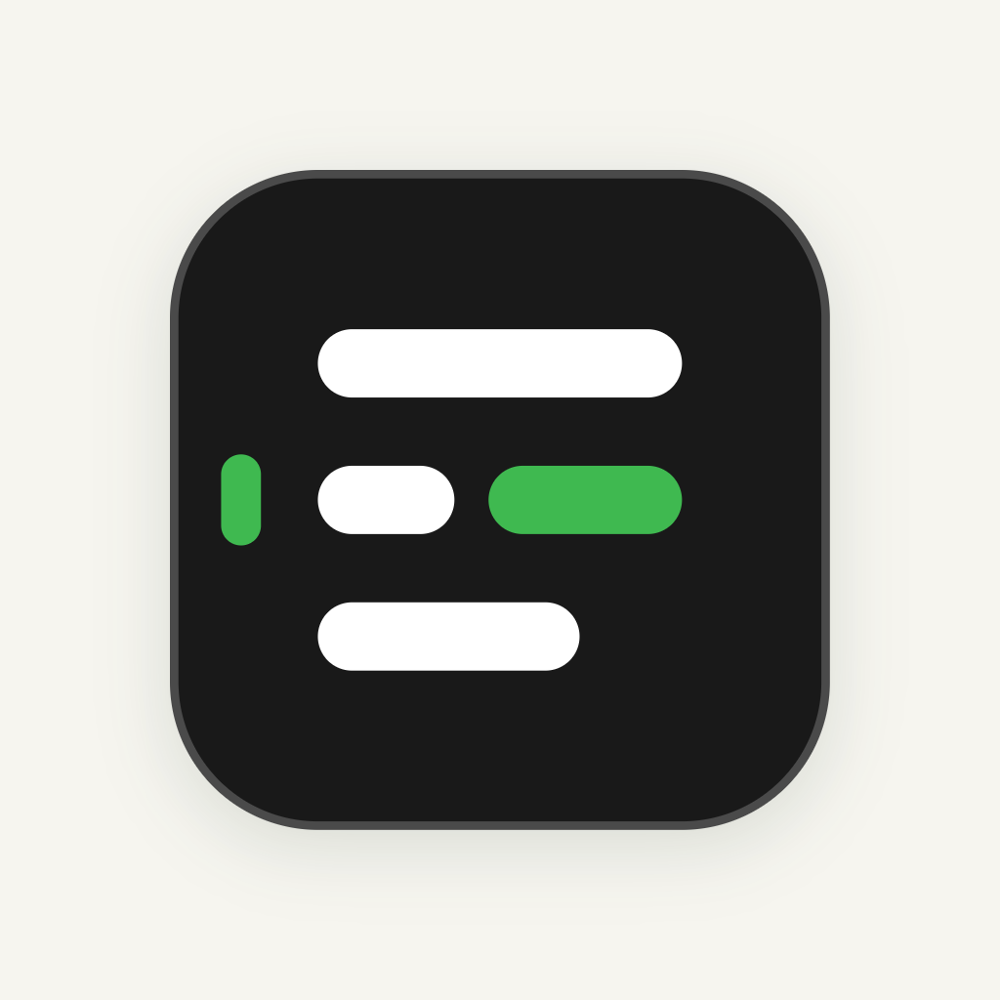
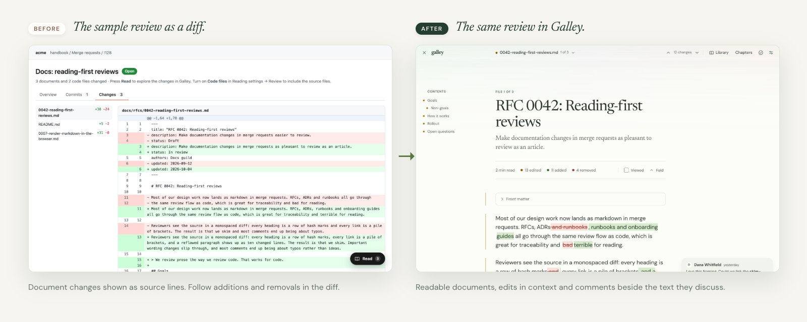

  

<h1 align="center">Galley</h1>

<em>Understand changes. Review in peace.</em> Clearer code and document reviews for teams on GitHub and GitLab.

  
  
  
  
  

  

  <a href="https://chromewebstore.google.com/detail/galley-markdown-reader-fo/ccmihhdpegbhbijhahdanmcbbpoeneic"><strong>Add to Chrome</strong></a> ·
  <a href="https://m9rc1n.github.io/galley/demo/">Try the live demo</a> ·
  <a href="https://m9rc1n.github.io/galley/">Website</a>

---

A useful review starts with understanding the change. Galley is a free, open-source browser extension that helps your team read the explanation, inspect the edits and discuss the details in one view.

Press **Read** on a GitHub pull request or GitLab merge request. Documents open as readable articles, with changed words shown inside their sentences. Turn on **Code files** to include supported source files with line numbers, syntax colours and wrapped lines. JavaScript and TypeScript tests open as readable specifications: scan the behavior names, see which cases changed, then review the code. Comments and replies sit beside the text they discuss and go back to the original review.

Your team gets more context for its feedback, using the GitHub or GitLab workflow it already knows.

## Before / after

  

The same merge request, files and comments, shown in a more readable view. Teammates can read and respond to your comments on GitHub or GitLab without installing Galley.

## How Galley helps

1. **Make the content readable.** Documents keep their headings, tables, task lists, footnotes, alerts, images and Mermaid diagrams. Code keeps its line numbers, syntax colours and diff signs, with long lines that wrap to fit the screen.
2. **See edits in context.** Added words are highlighted and removed words struck through inside their sentences. Table edits appear in their cells. Changed link destinations are called out even when the link text stays the same.
3. **Focus on what changed.** Changes to paragraph wrapping are not marked as text edits. Unchanged sections fold away; open them whenever you need more context. Lockfiles, generated files and whitespace-only edits fold to one line each, code that moved says where it went, tests follow the code they test, and JavaScript and TypeScript files start with a short list of the functions, classes and types that changed. Come back tomorrow and Galley offers to continue where you stopped. Your scrollbar gets a breather.
4. **Discuss it beside the text.** Read threads beside their paragraph or code line. Select text to add a comment, reply in the thread, and keep drafts while you read on. Comments and replies go to the original GitHub or GitLab review.
5. **Find your reading comfort.** Choose from nineteen palettes, six typefaces, five text sizes and six layouts, with light and dark modes, compact spacing and keyboard shortcuts.
6. **Keep your work on your code host.** Files render in your browser. Galley has no server, account or analytics. External images load only when you choose.

Source changes that do not appear in the rendered document, such as HTML comments and link definitions, are counted and linked to the platform diff.

## At a glance

| | |
| ---: | --- |
| **0** | Galley accounts needed. Use your existing GitHub or GitLab access. |
| **1** | **Read** button to open changed documents and supported code files. |
| **19** | reading palettes, each available in light and dark. |
| **6 · 5 · 6** | typefaces, text sizes and layouts to suit your screen and your eyes. |
| **20** | keyboard shortcuts for navigation, comments and settings. |
| **120** | characters of code per line on a wide screen, before wrapping. |

## Install

1. [Add Galley to Chrome](https://chromewebstore.google.com/detail/galley-markdown-reader-fo/ccmihhdpegbhbijhahdanmcbbpoeneic). Edge, Brave and Arc take the same build.
2. Open a GitHub pull request or a GitLab merge request.
3. Press **Read** in the bottom-right corner.

No Galley account needed. Private repositories and self-hosted sites have a few setup steps below.

- **Private GitHub repositories** need a [fine-grained token](https://github.com/settings/personal-access-tokens/new) with read-only *Contents* and *Pull requests* access, pasted into the Galley popup. Commenting also needs *Pull requests: read and write*. The token stays in extension storage that web pages cannot read.
- **GitLab** uses your signed-in session. Self-managed GitLab and GitHub Enterprise Server are enabled one domain at a time from the popup.
- **Want to look first?** The [live demo](https://m9rc1n.github.io/galley/demo/) runs the real reader on a sample merge request in your browser.
- **Firefox** builds are attached to every [release](https://github.com/m9rc1n/galley/releases); the add-ons listing is not published yet. Building from source is in [CONTRIBUTING.md](CONTRIBUTING.md).

The [user guide](docs/GUIDE.md) covers every setting, token and platform detail. Everything else, from architecture and design decisions to proposals and how-to guides, starts at [docs/README.md](docs/README.md).

## Keys

| Key | |
| --- | --- |
| <kbd>J</kbd> <kbd>K</kbd> | Next / previous change |
| <kbd>N</kbd> <kbd>P</kbd> | Next / previous conversation |
| <kbd>]</kbd> <kbd>[</kbd> | Next / previous file |
| <kbd>F</kbd> | Go to a file |
| <kbd>R</kbd> | Comment on the selection, or on the paragraph in focus |
| <kbd>⌘</kbd>/<kbd>Ctrl</kbd> <kbd>Enter</kbd> | Post the comment or reply |
| <kbd>V</kbd> | Mark the file viewed |
| <kbd>C</kbd> | Change marks on / off |
| <kbd>A</kbd> | Changed parts / whole files |
| <kbd>L</kbd> · <kbd>D</kbd> | Next layout · comfortable / compact |
| <kbd>+</kbd> <kbd>−</kbd> <kbd>0</kbd> | Larger / smaller / default text |
| <kbd>,</kbd> · <kbd>?</kbd> | Settings · these shortcuts |
| <kbd>Esc</kbd> | Close the innermost thing, and finally the reader. Drafts are kept. |

## FAQ

**Do my teammates need Galley?**
No. Comments and replies appear in the original GitHub or GitLab review. Teammates can read and respond there, whether or not they use Galley.

**Can I review code as well as documents?**
Yes. Markdown documents open as readable articles. Turn on **Code files** in **Reading settings → Review** to include supported source and configuration files, with syntax colours, wrapped lines and comments beside the code.

**Where do my files and comments go?**
Galley loads files from your GitHub or GitLab site and renders them in your browser. Comments go back to that review when you post. There is no Galley server or analytics. The demo keeps comments in your browser session and does not post to either platform.

**How does it help my team review changes?**
Galley puts readable content, edits and discussion in one view. Reviewers can follow the proposal, inspect a change in context and ask a question beside it. We have not measured review speed; the focus is helping people understand the work.

**Can I approve a request from Galley?**
You can read, comment, reply and mark files as viewed in Galley. Return to GitHub or GitLab to approve the request, request changes or resolve a thread.

**Why “Galley”?**
A galley proof lets editors read a book's text and leave notes before publication. Galley brings that approach to code and document reviews, with readable content and space for feedback.

## Privacy and security, the short version

- Galley contacts only the GitHub or GitLab site you are on. No backend, no analytics, no telemetry.
- Documents render in a shadow DOM after sanitising. Raw HTML in a pull request cannot run scripts, load trackers, or imitate Galley's change markers.
- Mermaid and syntax highlighting run in sandboxed frames with no access to the page, your session or the network.
- Text Galley adds to a comment (the file path and the quote) is posted as code, so a pull request cannot make your comment mention people or show images.
- The GitHub token never enters the page. Only Galley's background worker uses it, for an allowlist of the reader's own API calls.

The [privacy policy](PRIVACY.md) has the details. Security reports go through [SECURITY.md](SECURITY.md).

## Limitations

- Comments anchor to whole source blocks (paragraphs, list items, code lines), and GitHub and GitLab threads are flat, so replies are one level deep. Resolving happens on the platform for now.
- Platform-specific syntax renders approximately: GitLab's `[[_TOC_]]`, math and PlantUML show as text or code, and `#123` / `@user` are not linked.
- The whole pull or merge request is shown; a commit range picked in the platform is not.
- A paragraph rewritten by more than 60% shows as old removed and new added, not as word edits.
- Large requests are listed up to 1,000 files on GitHub and 2,000 on GitLab.

## Roadmap

1. **Conversation in the margin.** Resolve threads from the reader.
2. **Review flow.** Approve or request changes without leaving it.
3. **Richer rendering.** Math, issue and user references.
4. **Distribution.** A Firefox Add-ons listing.

## Contributing

Tell us what makes your reviews harder: a long document, missing context, an accessibility barrier, a conversation that is hard to follow. [Issues](https://github.com/m9rc1n/galley/issues) and pull requests shape the project. [CONTRIBUTING.md](CONTRIBUTING.md) has the setup, architecture and contribution guidelines, [PUBLISHING.md](PUBLISHING.md) the store release steps, and [store/ARTWORK.md](store/ARTWORK.md) how every image in this README is made. Larger ideas start as [RFCs](docs/rfcs/README.md); the decisions behind the code are in the [architecture decision records](docs/adr/README.md).

## License

[GPL-3.0-or-later](LICENSE) © Marcin Urbanski. Free to use, study, change and share. If you distribute a modified version, publish its source under the same license. The licences of the bundled libraries ship in `THIRD_PARTY_NOTICES.txt` inside every build. Releases up to and including 0.4.1 were published under MIT and stay available under it.

**Commercial license.** Building Galley into a closed-source product, or shipping a modified version without its source? A separate commercial license is available: [open an issue](https://github.com/m9rc1n/galley/issues/new/choose) titled "Commercial license", leave your contact details out, and you'll get a private way to talk.

Understand changes. Review in peace.

