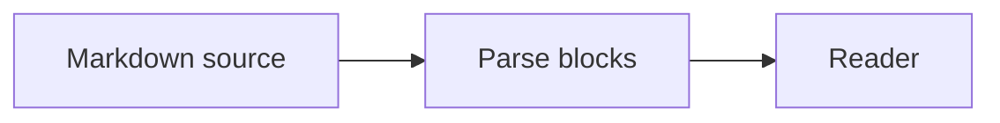

# RFC 0042: Reading-first reviews

Most of our design work now lands as markdown in merge requests. RFCs, ADRs and runbooks all go through
the same review flow as code, which is great for traceability and bad for reading.

Reviewers see the source in a monospaced diff: every heading is a row of hash marks and every link is a pile of brackets. The result is that we skim and most comments end up being about typos.

## Goals

- Render changed documents the way readers will see them.
- Show what changed inside the text itself.
- Keep the merge request as the source of truth.

### Non-goals

- Replacing the diff view.
- Building a new comment system in the first iteration.
- Supporting AsciiDoc and reStructuredText.

## How it works




A small browser extension adds a button to merge requests that change markdown files. It loads the old and the new version of each document and compares them line by line.

| Change | Shown as |
| --- | --- |
| Words added or removed in a paragraph | Inline highlight |
| New paragraph or list item | Margin marker |
| Removed block | Red text where it used to be |


```ts
const changes = diffLines(base, head);
for (const change of changes) annotate(change);
```

## Rollout

1. Dogfood with the docs guild.
2. Share with the platform team.
3. Decide on comments (see open questions).

## Alternatives considered

Building a preview environment for every merge request gives reviewers the real site, but it takes minutes to build and still does not show what changed.

## Open questions

How should comments work?
