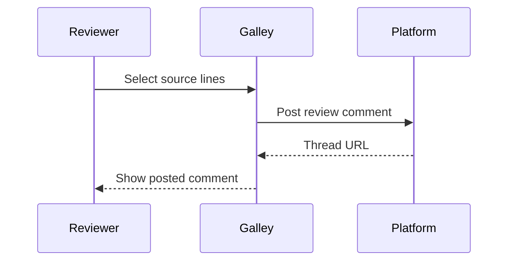

# ADR 0007: Render markdown in the browser

- **Status:** Accepted
- **Date:** 2026-10-04

## Context

Reviewers need to read documentation changes as rendered text. We could ask GitLab and GitHub to render the markdown for us, or render it ourselves.

## Decision

We render markdown in the browser with markdown-it and sanitise the result with DOMPurify. The platform renderers do not consistently return source positions, which we need to match rendered blocks to each other and, later, to source lines for comments.

## Consequences

- Rendering is fast and works the same on every platform.
- Platform-specific syntax, such as GitLab's `[[_TOC_]]`, may render slightly differently from the platform itself.
- Every rendered document is sanitised, because merge requests can come from forks.

## Review sequence

