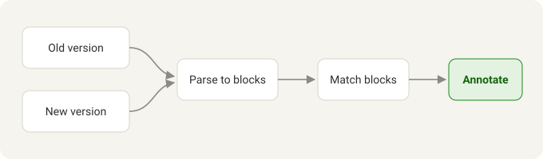

# RFC 0042: Reading-first reviews

Most of our design work now lands as markdown in merge requests. RFCs, ADRs, runbooks and onboarding guides all go through the same review flow as code, which is great for traceability and terrible for reading.

Reviewers see the source in a monospaced diff: every heading is a row of hash marks, every link is a pile of brackets, and a reflowed paragraph shows up as ten changed lines. The result is that we skim. Important wording changes slip through, and most comments end up being about typos rather than ideas.

> We review prose the way we review code. That works for code.

## Goals

- Render changed documents the way readers will see them, with typography built for long-form reading.
- Show what changed inside the text itself: inserted words, removed words, new and deleted sections.
- Keep the merge request as the source of truth. Nothing new to adopt, no export, no second tool.
- Work for GitLab and GitHub, including self-hosted instances.

### Non-goals

- Replacing the diff view. Source review is still the right tool for code blocks and front matter.
- Building a new comment system in the first iteration.

## How it works

A small browser extension adds a **Read** button to merge requests that change markdown files. It loads the old and the new version of each document, renders both, and compares them block by block.

| Change | Shown as |
| --- | --- |
| Words added or removed in a paragraph | Inline highlight and strikethrough |
| New paragraph, list item or section | Green wash and a margin marker |
| Removed block | Red text where it used to be |
| Whitespace and line wrapping | Ignored |



Paragraphs are matched by their text, not by line numbers, so re-wrapping a paragraph produces no noise.[^wrap] When a block was rewritten almost completely, the reader shows the old and the new version one after another instead of a confetti of tiny edits.

```ts
const renderOptions = { showInsertedWords: true, showRemovedParagraphs: true, preserveSourceLines: true };
const changes = diffUnits(base.units, head.units);
for (const change of changes) annotate(change, renderOptions);
```

> [!NOTE]
> Nothing leaves the browser. Files are fetched with the reviewer's own session, rendered locally and sanitised before display.

## Rollout

1. Dogfood with the docs guild for two weeks.
2. Share with the platform and security teams.
3. Collect feedback in #reading-first-reviews.
4. Decide on comments (see open questions).

- [x] Prototype for GitLab and GitHub
- [x] Light, sepia and dark themes
- [ ] Commenting on a selected sentence
- [ ] Store listing

## Open questions

How should comments work? The simplest option posts a regular review comment on the source lines behind the selected paragraph. A richer option anchors comments to the quoted sentence, so they survive later edits.

[^wrap]: Whitespace changes are still visible in the regular diff view.
