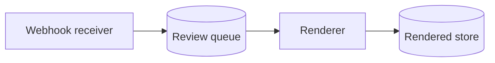

# Architecture overview

The reviews service turns a merge request into something people can read. It has three parts.

## Receiving changes

The webhook receiver accepts merge request events and puts one job per change on the queue. Why a queue and not direct calls is in [ADR 0003](../adr/0003-queue-for-reviews.md).

## Rendering

Documents are parsed and rendered in the reader's browser, never on a server. See [ADR 0007](../adr/0007-render-markdown-in-the-browser.md) and the proposal that started it, [RFC 0042](../rfcs/0042-reading-first-reviews.md).

## Operating it

Deploys follow the [deploy runbook](../runbooks/deploy.md).
