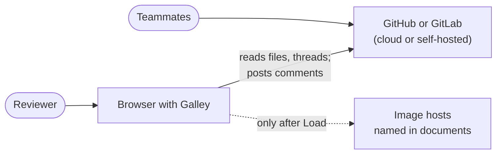
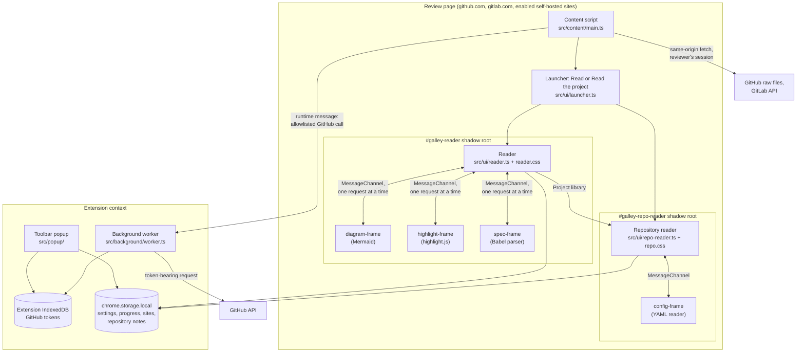
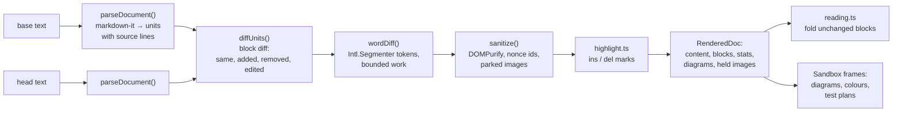
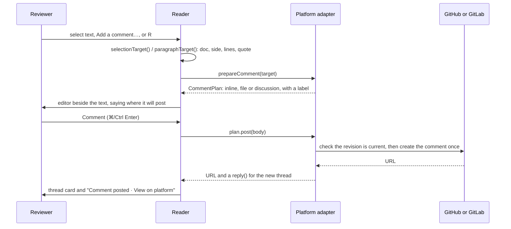

# Architecture

How Galley is put together: what runs where, how a review gets from GitHub or GitLab onto the screen, and where to find each part. For why it is built this way, follow the links to the [decision records](../adr/README.md).

- [System context](#system-context)
- [Runtime components](#runtime-components)
- [Opening a review](#opening-a-review)
- [Rendering a document](#rendering-a-document)
- [Posting a comment](#posting-a-comment)
- [Module map](#module-map)
- [The `ReviewSource` contract](#the-reviewsource-contract)
- [Build outputs](#build-outputs)
- [Invariants](#invariants)

Related: [Security model](security-model.md) · [Storage inventory](storage.md) · [UI map](../design/ui-map.md) · [Glossary](../glossary.md)

## System context

Galley is a browser extension with no server ([ADR 0002](../adr/0002-no-server-no-telemetry.md)). It talks only to the GitHub or GitLab site the reviewer is on.



## Runtime components



| Component | Runs in | Can reach | Cannot reach |
| --- | --- | --- | --- |
| Content script | The review page's renderer | The page's DOM and origin (the reviewer's session), `chrome.storage.local`, runtime messages | GitHub tokens |
| Reader | The same content script, inside a shadow root | Its own DOM, settings and progress storage | The page's styles, tokens |
| Sandbox frames | Sandboxed extension pages with opaque origins | Only the `MessagePort` the reader hands them | The page, the session, extension APIs, storage, the network |
| Image fallback | A separate sandboxed frame with an opaque origin | One HTTP(S) image after the reader permits loading; a transferred reply port | Page DOM, tokens, extension APIs, storage, API requests, remote code |
| Background worker | The extension's service worker | Tokens, the GitHub API (allowlisted calls only), `chrome.scripting` for enabled sites | Page DOM |
| Popup | An extension page | Tokens (save and remove), site permissions | Review content |

## Opening a review

```mermaid
sequenceDiagram
  autonumber
  participant P as Review page
  participant C as Content script
  participant A as Platform adapter
  participant W as Background worker
  participant G as GitHub or GitLab
  participant R as Reader
  P->>C: document_idle, turbo:load, popstate, or URL change (polled each second)
  C->>C: detectContext(): is this a pull or merge request?
  C->>A: loadSource(context)
  A->>W: GitHub: allowlisted API calls (token attached here if saved)
  W->>G: pull request, files (paginated)
  A->>G: GitLab: API with the session
  A-->>C: ReviewSource (files, links, load(), threads, comment plans)
  C->>P: Launcher shows "Read" and a count
  P->>R: reviewer presses Read
  R->>A: load(doc) for each file, in reading order
  A->>G: head from the same-origin raw URL; base rebuilt from the patch (GitHub) or fetched at the merge base (GitLab)
  R->>R: render, diff, sanitise, lay out
  R->>A: loadThreads(), Viewed state
```

Sources are cached per review, so reopening the reader on the same review is instant; saving or removing a token in the popup reloads the open review on that site without a page reload. See [ADR 0007](../adr/0007-rebuild-github-base-from-the-patch.md) for how GitHub versions are loaded within the unauthenticated rate limit.

The sequence above is the default, with **Read button on the page** on. The content script first reads that setting; off, it only detects the page and makes no platform requests. The popup asks for `galley:page-state` to name the page without loading it. **Read this review**, **Read the project**, and the worker's `read-page` extension command send `galley:open-reader`; only then does the content script load the matching source. These messages accept only Galley's own extension contexts, never another content script or a page-provided URL. An already open reader is focused rather than replaced. The options page writes only the page-button choice, and reader controls merge only their changed preferences, so an open reader preserves that newer choice.

## Rendering a document



Source files take a parallel path (`src/ui/code-files.ts`): one block per line, old and new line numbers, two lines of context, then enhancements that each degrade to plain source when they cannot apply: syntax colours, moved code, the declaration line, formatted comments and test plans. Details: [ADR 0003](../adr/0003-parse-and-compare-markdown-in-the-browser.md), [ADR 0006](../adr/0006-sanitise-all-rendered-html.md), [ADR 0011](../adr/0011-sandbox-third-party-engines.md), [ADR 0020](../adr/0020-read-code-statically.md).

## Posting a comment



A failure keeps the draft; writes are never retried ([ADR 0008](../adr/0008-comment-through-platform-review-apis.md)).

## Module map

| Folder | Responsibility | Key files | Environment |
| --- | --- | --- | --- |
| `src/content/` | Page detection, launcher, single-page navigation, token-change signal | `main.ts` | Page (jsdom in tests) |
| `src/platforms/` | GitHub and GitLab adapters behind `ReviewSource` and `RepositorySource`; detection of reviews and repository pages; HTTP with retries; comments and threads; Viewed sync; tokens and enabled sites | `types.ts`, `index.ts`, `detect.ts`, `github.ts`, `github-api.ts`, `github-read.ts`, `github-repo.ts`, `github-queries.ts`, `github-viewed.ts`, `gitlab.ts`, `gitlab-repo.ts`, `comments.ts`, `http.ts`, `tokens.ts`, `sites.ts` | Node in tests |
| `src/core/` | Pure logic, no DOM: Markdown units, block and word diffs, limits, DOM highlighting of ops, patch reversal, paths and links, reading order, folded-file rules, chapters; repository listing budgets, the document index, architecture and decision views, notes and their export | `markdown.ts`, `blockdiff.ts`, `worddiff.ts`, `limits.ts`, `highlight.ts`, `patch.ts`, `paths.ts`, `order.ts`, `quiet.ts`, `chapters.ts`, `discovery.ts`, `docindex.ts`, `architecture.ts`, `notes.ts` | Node in tests |
| `src/ui/` | The reader: overlay, rendering pipeline, settings, storage of progress and positions, sandbox frames and their clients, code views, chapters UI; the repository reader, its views and the notes store | `reader.ts`, `reader.css`, `render.ts`, `reading.ts`, `settings.ts`, `viewed.ts`, `positions.ts`, `sandbox.ts`, `*-frame.ts`, `code*.ts`, `specs.ts`, `symbols.ts`, `moves.ts`, `source-comments.ts`, `diagrams.ts`, `chapters.ts`, `icons.ts`, `fonts.ts`, `repo-reader.ts`, `repo-views.ts`, `repo.css`, `configs.ts`, `project-store.ts`; shared by both readers: `dom.ts` (chips, settings rows, switches, selects, text fields), `settings-sheet.ts` and `layout-controls.ts` (shared picker and library session state) | jsdom in tests |
| `src/background/` | The only holder of GitHub tokens; allowlisted API proxy; restores enabled sites | `worker.ts` | Node in tests |
| `src/popup/` | Open the current reader; enable a self-hosted site; save or remove a GitHub token; open extension settings | `popup.ts`, `popup.html`, `popup.css` | jsdom in tests |
| `src/options/` | Choose whether the page offers a Read button | `options.ts`, `options.html`, `options.css` | jsdom in tests |
| `src/dev/` | Live reload for `npm run dev` | `reload.ts` | Node in tests |
| `src/testing/` | Test helpers; never shipped | `reader.ts`, `repo.ts`, `render.ts`, `http.ts`, `indexeddb.ts`, `sandbox.ts` | — |
| `demo/` | The real reader on a sample review; `?spec`, `?comments`, `?large`, `?chapters`, `?code-only`, `?diagram-error`; `?repo` for the repository reader on a sample handbook | `main.ts`, `index.html`, `samples/` | Browser |
| `site/` | The website | `index.html`, `styles.css`, `main.js` | Browser |
| `scripts/` | Build, dev server, demo and site servers, store assets, Pages previews, docs check, the repository reading report | `build.mjs`, `dev.mjs`, `docs.mjs`, `pages-*.mjs`, `repo-report.mjs` | Node |
| `e2e/` | Browser checks in Chrome with Puppeteer | `reader.mjs`, `specs.mjs`, `large.mjs`, `files.mjs`, `chapters.mjs`, `repo.mjs`, `site.mjs` | Chrome |

Dependencies point inwards: `core` imports only types from `platforms/types.ts`; `platforms` imports `core`; `ui` imports `core` and `platforms/types.ts`; `content` wires `platforms` and `ui` together. Nothing outside `src/background/` and `src/popup/` imports token storage, and the build enforces it.

## The `ReviewSource` contract

`src/platforms/types.ts` is the seam between platforms and the reader. A platform adapter returns one `ReviewSource` per pull or merge request:

| Member | Purpose |
| --- | --- |
| `title`, `subtitle`, `diffUrl` | What the reader shows, and the way back to the platform |
| `docs`, `codeDocs`, `otherFiles` | Changed Markdown documents, supported source files, and everything else (shown in the chapter map) |
| `load(doc)` | Both versions of one file (`{ base, head }`) |
| `links(doc)` | URLs for raw files and platform pages at the reviewed revision |
| `viewed?` | Native Viewed state, when the platform and authentication support it |
| `prepareComment?(target)` | Where a comment on these lines would go, and how to post it |
| `loadThreads?()` | Existing review threads, each with `reply?()` |
| `overview?` | The request's own title and description |

Errors meant for the reviewer are `ReaderError(message, hint, needsToken)`. A new platform implements this interface; the reader does not change. `project?` opens the review's repository at its base or head (`ReviewProject`, below).

## The `RepositorySource` contract

The repository reader (`src/ui/repo-reader.ts`) reads a project's own docs through a separate interface, not a fabricated review ([RFC 0049](../rfcs/0049-repository-docs-and-project-maps.md), [ADR 0024](../adr/0024-read-a-repository-at-one-commit.md)):

| Member | Purpose |
| --- | --- |
| `id`, `name`, `platform`, `url` | The repository, whichever commit is read; `id` keys the reader's notes ([ADR 0028](../adr/0028-private-project-notes.md)) |
| `ref`, `commit`, `pinned` | The branch or tag the page showed, the one commit every read uses, and whether there is anything newer to check |
| `start` | The document or folder the reader opened at |
| `discover()` | Markdown documents and configuration files at the commit, within the listing budgets (`src/core/discovery.ts`) |
| `load(path)` | One file at the commit |
| `links` | Raw and platform URLs at the commit |
| `refresh()` | The same branch or tag again: a new snapshot when it moved |
| `newIssue(title, body)` | The platform's new-issue form filled in, for an export the reader chooses to share |

The reader keeps one `ProjectIndex` (`src/core/docindex.ts`) per snapshot for the outline, backlinks and the map; the architecture and decision views (`src/core/architecture.ts`) are built from it, from configuration read in `config-frame`, and from the reader's own proposals.

Both readers compose their layout picker from `src/ui/layout-controls.ts`, tested independently in `layout-controls.test.ts`. The review keeps its persisted `Settings.layout`; the library owns a `LibraryLayout` instance that starts in Focus and lasts until close. Applying a library layout updates only its own root and selected controls, and restores its paragraph after reflow. No new storage key or repository content is persisted. See the [library delivery and state contract](../design/project-library.md) for the next chapter-context work.

## Build outputs

`npm run build` (`scripts/build.mjs`, esbuild) writes:

| Output | Contents |
| --- | --- |
| `dist/chrome/`, `dist/firefox/` | `content.js`, `background.js`, `popup.*`, the five frame pages and scripts (four engines and the image fallback), `elk.js`, icons, the manifest with the package version, `THIRD_PARTY_NOTICES.txt` |
| `dist/*.zip` | Store-ready archives with `--zip`; releases also attach a source archive |
| `demo/build/` | The demo bundle and copies of the frames |
| `dist/dev/` | The development build (`npm run dev`): orange icon, DEV badges, source maps, live reload, its own storage |

The build fails if token storage reaches `content.js` or a frame. Our own bundles stay readable; only Mermaid and its layout engine are minified ([ADR 0005](../adr/0005-plain-typescript-and-dom.md)).

## Invariants

Breaking one of these needs a superseding ADR, not a code review exception.

1. No server, telemetry or remote code ([ADR 0002](../adr/0002-no-server-no-telemetry.md)).
2. Every content string reaches the DOM through `sanitize()` or as text ([ADR 0006](../adr/0006-sanitise-all-rendered-html.md)).
3. Third-party engines that read content run only in sandbox frames, and their replies are validated ([ADR 0011](../adr/0011-sandbox-third-party-engines.md)).
4. Tokens never enter the page; the worker makes only allowlisted calls ([ADR 0009](../adr/0009-github-tokens-in-the-background-worker.md)).
5. Repository code is never executed ([ADR 0020](../adr/0020-read-code-statically.md)).
6. Writes to the platform happen once, on an explicit action ([ADR 0008](../adr/0008-comment-through-platform-review-apis.md)).
7. Stored progress is fingerprints only ([ADR 0019](../adr/0019-review-progress-as-fingerprints.md)).
8. Every source file is fully covered by tests ([ADR 0017](../adr/0017-full-coverage-of-every-file.md)).
