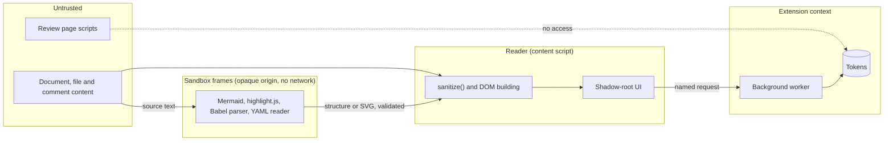

# Security model

Galley renders content anyone can write, inside a reviewer's authenticated session, next to a token they may have saved. This page lists what we protect, from whom, where the boundaries are, and which test fails if one moves. Report vulnerabilities through [SECURITY.md](../../SECURITY.md).

## What we protect

1. **The reviewer's GitHub token.** It must never be readable by a page, and never usable for calls Galley does not make.
2. **The reviewer's session.** Content must not run script in the review page or act as the reviewer.
3. **The integrity of the review.** Content must not fake, move or hide Galley's change marks, nor put words in the reviewer's comments.
4. **The reviewer's privacy.** Nothing about what they read reaches a third party without their choice.
5. **The reviewer's browser.** Hostile input must not freeze the tab.

## Who we defend against

| Adversary | Can control | Wants to |
| --- | --- | --- |
| Pull request author (often a fork) | File contents, names, Mermaid sources, test files, descriptions, comments | Run script, steal the token, misrepresent a change, track readers, freeze the page |
| Commenter on the review | Comment bodies, display names | The same, through threads |
| The review page itself (a compromised or malicious page script) | The page's DOM and JavaScript | Read the token, use Galley as a proxy |
| Image hosts | Responses to image requests | Learn who reads what |

Out of scope: a compromised browser or extension store, and the platform itself.

## Trust boundaries

| Boundary | Enforced by | Tests |
| --- | --- | --- |
| Content → DOM | `sanitize()` in `src/ui/render.ts`; the Biome rule `lint/no-unsanitized-html.grit` bans other HTML sinks | `render.test.ts`, `render-edges.test.ts`, `core/edges.test.ts` |
| Content → Galley's own markup | Per-render nonce on block ids; class allowlist; no `data-*` from content; `user-content-` id prefix | `render.test.ts` |
| Content → network | Only `` may fetch, and external ones wait for consent; `srcset`, media, CSS and SVG references are removed | `render.test.ts`, `reader.test.ts` |
| Content → links | Relative links decoded before resolving dot segments; thread and "View on" links limited to the review origin | `core/paths.test.ts`, `core/edges.test.ts` |
| Content → reviewer's comment | Path and quote posted as code; quote capped at 1,000 characters | `platforms/comments.test.ts` |
| Content → engines | Sandbox frames: opaque origin, CSP `default-src 'none'`, one request at a time, watchdog, input caps; replies validated | `sandbox.test.ts`, `*-frame.test.ts`, `e2e/reader.mjs` |
| Content → execution | Test files, declarations and configuration files are parsed, never run; YAML aliases are never expanded, includes never followed ([ADR 0027](../adr/0027-read-configuration-statically.md)) | `spec-frame.test.ts`, `config-frame.test.ts` |
| Page → token | Tokens in extension IndexedDB; only the worker attaches them; the build fails if token code reaches `content.js` or a frame | `worker.test.ts`, `tokens.test.ts`, `scripts/build.mjs` |
| Page → API proxy | Worker checks the sender is Galley's content script, takes the site from the browser, allows only listed calls for the pull request or repository in that tab: on a repository page, resolving a ref and listing that repository's tree; on a pull request page, also listing its own repository's tree ([ADR 0025](../adr/0025-repository-reads-in-the-token-allowlist.md)) | `worker.test.ts`, `github-api.test.ts` |
| Hostile size or complexity | Document size cap, bounded diffs (2,000 edits, 250 ms), frame input caps, thread bodies capped at 65,536 characters; repository listings capped at 2,000 documents and 60 configuration files, configuration at 256,000 characters and 400 declarations | `limits.test.ts`, `edges.test.ts`, `discovery.test.ts`, `config-frame.test.ts` |
| Stored notes → reader | The reader's own notes are checked item by item when read; malformed entries are dropped, never trusted ([ADR 0028](../adr/0028-private-project-notes.md)) | `notes.test.ts`, `project-store.test.ts` |
| Permissions | Only `github.com` and `gitlab.com` by default; other hosts optional, one site at a time | Review; a new permission needs an ADR |

## Rules for contributors

- Never write a string as HTML. Build DOM nodes, use `textContent`, or pass content through `sanitize()`. A static template of fixed markup needs `// biome-ignore lint/plugin: <reason>`.
- Never add a network request, host permission, storage key or dependency without updating [PRIVACY.md](../../PRIVACY.md), the [storage inventory](storage.md) and, for a new boundary, an ADR.
- Never import `src/platforms/tokens.ts` or `src/background/` from page-facing code.
- Never retry a write. Never post without an explicit action.
- Treat everything from a sandbox frame as untrusted input.
- Write the hostile test first: a document that tries the attack, asserting it fails.

## Supply chain

- CI and release workflows pin actions by commit, check out without persisted credentials, and install with `--ignore-scripts`.
- The release job that can write and sign is separate from the job that builds and tests; releases carry checksums and build provenance.
- Dependabot keeps dependencies current; `npm audit` runs in CI and weekly.

## References

[ADR 0002](../adr/0002-no-server-no-telemetry.md), [0006](../adr/0006-sanitise-all-rendered-html.md), [0009](../adr/0009-github-tokens-in-the-background-worker.md), [0010](../adr/0010-external-images-behind-consent.md), [0011](../adr/0011-sandbox-third-party-engines.md), [0020](../adr/0020-read-code-statically.md), [0025](../adr/0025-repository-reads-in-the-token-allowlist.md), [0027](../adr/0027-read-configuration-statically.md), [0028](../adr/0028-private-project-notes.md); commits `6b4a973`, `a20bac7`, `6316046`, `c255127`.
