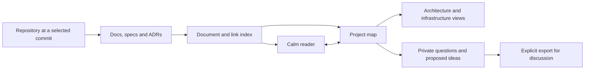

# RFC 0049: Repository docs reading, project maps and architecture exploration

## Problem and intended outcome

Specs, ADRs, architecture notes and infrastructure explanations are often scattered across a repository. A reviewer or new teammate needs to find the relevant documents, understand how they connect, and distinguish an intended design from a proposal or a declaration in configuration.

Extend Galley from reading changes to **reading the project**: a calm repository reader with a navigable document map, source-backed architecture views and a private space for questions and brainstorming.

The experience should let a reader move from “What is this project?” to “Why was this decision made?” to “Where does this change fit?” without losing their place. Whether these views improve understanding is a hypothesis to validate.

## Product shape

Three connected surfaces:

1. **Reader:** full specs, docs and ADRs with Galley's typography, headings, diagrams, relative links and reading-position behavior.
2. **Project map:** a browsable outline/mindmap with backlinks and cross-document relationships. Selecting a node opens its evidence in the reader.
3. **Thinking space:** private ideas, questions, alternatives and tentative connections attached to source nodes.

Architecture and infrastructure are focused views of that same map. Begin with one selected concern and its neighbors; keep a searchable list/outline alternative so a large graph does not become another source of paralysis.

This diagram describes the proposed product, not the architecture of an inspected repository.

## Phase 0 — Validate the workflow and provider foundations

- [ ] Prototype finding a spec, following its ADR, opening related implementation/deployment evidence and recording a question.
- [ ] Use Galley's own docs and representative small/large repositories, including one with incomplete or contradictory documentation.
- [x] Spike repository-page detection, selected-ref resolution, commit-pinned tree/file reads and the token-worker allowlist.
- [ ] Verify both supported providers' basic read paths; identify self-hosted/version differences before promising parity.
- [x] Select an initial file/request/index budget and define what “partially indexed” looks like.

**Exit gate:** readers can complete the prototype tasks and the engineering spike establishes a bounded, authenticated read path. Set estimates and acceptance targets from these findings before committing delivery dates.

## Phase 1 — Read repository docs without opening an MR

- [x] Add a “Read docs” entry point on supported repository and Markdown file/folder pages.
- [x] Resolve the selected branch/tag/commit to a stable commit for the session, display it and refresh explicitly.
- [x] Discover Markdown from README files and selectable documentation roots such as `docs/`, `specs/` and ADR directories. These are useful starting hints, not a mandatory folder convention.
- [x] List candidates first and fetch content lazily; support a single-document entry without requiring a repository scan.
- [x] Reuse sanitization, typography, headings, tables, image controls and sandboxed diagram rendering.
- [x] Follow in-repository relative links and anchors at the same commit; preserve back/forward position.
- [x] Show unsupported formats, unavailable files and discovery limits clearly, with provider/source fallbacks.
- [x] Keep this mode independent of diff marks, MR comments and provider Viewed/approval state.

**Exit gate:** a user can open a repo spec, follow a linked ADR and return to the same paragraph on desktop and mobile. Private/authentication failures, changing refs and repositories with few or no docs have clear behavior.

**Initial supported content:** Markdown and the existing safe diagram/source fallback behavior. MDX components or repository scripts are never executed. Additional document formats require separate parser/rendering decisions.

## Phase 2 — A map of the documentation

- [x] Build an index from document metadata, headings and explicit relative links.
- [x] Offer an outline/tree, backlinks and an optional mindmap view over the same index.
- [x] Identify linked specs, decisions, architecture notes and runbooks using explicit metadata or editable path-based hints.
- [x] Keep folder containment, document references and user-authored semantic relationships distinguishable.
- [x] A node opens its document/heading and identifies the source commit.
- [x] Unresolved references, missing anchors and partial indexing remain visible.
- [x] Support focused neighborhoods, collapse/expand, search and a keyboard-accessible list equivalent.
- [x] Keep deterministic placement where possible so revisiting does not rearrange the reader's mental map.

**Exit gate:** a reader can trace a spec to its linked decision and explain why the map connects them. Every source-derived edge exposes evidence. A folder hierarchy is not presented as a service dependency graph.

**First useful release:** Phases 1 and 2. Ship and evaluate repository reading plus a linked document map before expanding the architecture surface.

## Phase 3 — Architecture and infrastructure views

Add typed, source-backed entities where the repository provides evidence:

- **Architecture:** system boundaries, services/components, interfaces, data stores and documented flows.
- **Infrastructure:** environments, deployment units, CI/CD stages, infrastructure resources and links to operational runbooks.
- **Decisions:** ADR status, superseding decisions and the spec/component that a decision explains, when explicitly stated.

Start with reader-curated entities and relations anchored to docs. Later, add bounded inspection of selected configuration formats, such as Compose files, Kubernetes manifests, Terraform declarations or workflow files, after choosing supported syntax and limits. Existing diagram documents remain readable; translating diagrams into editable structured entities is a separate spike.

- [x] Every entity/relation identifies its origin: documented, declared in config, reader-proposed or unverified suggestion.
- [x] Source-backed items link to a file, heading/range and commit.
- [x] Readers can correct classifications and keep conflicting sources visible.
- [x] Environment and architecture views preserve access to the underlying document map.
- [x] Config inspection is static and on demand; no infrastructure commands or repository code run.
- [x] Declared configuration is not presented as observed live infrastructure.
- [x] Omitted files, unsupported formats and incomplete relationships are stated.

**Exit gate:** readers can explain a representative service boundary and deployment path using traceable evidence. Incorrect relationships, unsupported assumptions and conflicting documentation are recorded in validation, not hidden behind a polished diagram.

## Phase 4 — Private brainstorming anchored to the project

- [x] Add idea/question nodes, notes, alternative groups and tentative connections.
- [x] Mark proposals clearly and keep the source-backed project map recognizable underneath.
- [x] Let readers compare alternatives and record assumptions, open questions and next experiments.
- [x] Preserve anchors when source documents change, marking affected notes for reconfirmation.
- [x] Provide explicit local saving, recovery, deletion and export.
- [x] Export a selected discussion outline or Markdown/Mermaid representation with source links and provenance labels.
- [x] Preview exported content so private notes are not included accidentally.
- [x] Treat sharing, creating an RFC or proposing a repository edit as separate deliberate actions.

**Exit gate:** a reader can explore a proposed design, pause, reopen and recover their reasoning without confusing ideas with the project's documented state.

Begin with manual notes and connections. Optional automated suggestions need their own accuracy, provenance and data-flow decision; they are not a dependency of the first useful release.

## Phase 5 — Connect project understanding to reviews

- [x] From an MR, open relevant project docs/map context pinned to a clearly selected base or head revision.
- [x] Return to the original review position, draft and question.
- [x] Link changed paths to explicitly related specs, ADRs, components and runbooks.
- [x] Flag “related evidence changed” or “worth checking” without automatically claiming that a document is wrong.
- [x] Show which map relationships and private notes need reconfirmation after a refresh.
- [ ] Reuse review chapters, follow-ups, context previews and revision comparison where those RFCs are accepted.

**Exit gate:** a reviewer can explain where a change fits and revisit the supporting evidence without losing the review session.

## Implementation approach and dependencies

The current `ReviewSource` contract models changed documents with base/head content, review threads and comment actions. Introduce a repository source capability that exposes repository identity, a resolved commit, bounded discovery, lazy single-version document loading and source links. Share rendering/navigation capabilities while keeping review operations optional and separate. Do not fabricate an MR or duplicate the entire reader.

Update page detection for repository/file/folder contexts, including refs containing slashes, GitLab nested groups and self-hosted sub-paths. Extend the background-worker read allowlist narrowly for the active repository and approved resource paths; keep tokens out of the page renderer.

Use existing relative-path resolution and Markdown parsing to build the first index. Cache by repository/commit and treat refresh as a new snapshot. Preserve cancellation and avoid late updates to a closed reader.

GitHub's tree API reports truncation and documents subtree traversal for incomplete recursive results. Its contents API supports selected refs and read-only Contents access. These are candidate foundations, with explicit application budgets and partial-index behavior. [GitHub trees](https://docs.github.com/en/rest/git/trees#get-a-tree), [repository contents](https://docs.github.com/en/rest/repos/contents#get-repository-content)

GitLab provides repository tree listing and file reads with selected refs; implement pagination and capability checks against the supported instance versions. [GitLab repository trees](https://docs.gitlab.com/api/repositories/#list-all-repository-trees-in-a-project), [repository file reads](https://docs.gitlab.com/api/repository_files/#retrieve-a-raw-file-from-a-repository)

Dependencies: Phase 1 establishes source identity and reading; Phase 2 establishes map entities/provenance; Phase 3 adds domain views; Phase 4 adds durable personal thinking; Phase 5 links those capabilities back to reviews. Prototype pieces can be explored earlier without promising the full sequence.

## Privacy, scope and quality

Keep repository content processing local and fetching limited to the selected provider and user-requested scope. Do not automatically follow submodules, external repositories, embedded resources or live cloud services. Persistent maps/notes/export may retain repository identifiers and authored text beyond current fingerprint-only reading history; document storage, retention and clearing explicitly before enabling them.

Preserve current sanitization, external-image controls, sandbox boundaries and coverage gates. Add focused checks for ref/path resolution, cross-repository request rejection, malformed/oversized documents, partial trees, pagination, cycles, stale anchors and interrupted loads. Verify representative desktop/mobile maps, keyboard paths, list fallbacks and reduced motion.

The first release remains a repository reader and document map. A full IDE, live infrastructure inventory, autonomous design verdicts and repository editing are separate initiatives.

## Validation and decision gates

Use 5–8 readers spanning new teammates and experienced reviewers. Tasks: find the relevant spec, trace an ADR, explain a component boundary, locate deployment evidence, and resume a saved question.

Compare against provider navigation using comparable tasks. Record time to locate evidence, correct explanations, navigation loss, false map relationships, saved-thought recovery and perceived effort. Include small repositories and monorepos; measure map overload as well as discovery benefit. Collect observations in voluntary research sessions without adding product telemetry.

Advance phases when the earlier experience helps understanding and its provenance is trustworthy. Choose scope and measurable pilot targets after Phase 0; make no adoption, retention or time-saving claims in advance.

## Open decisions

- **Product:** Does repository reading deserve a separate entry point or a mode within the existing reader?
- **Engineering, blocking:** Which provider/ref/auth paths are supportable within the current token and permission model?
- **Design:** When is an outline better than a mindmap, and what should the initial neighborhood contain?
- **Product/design:** How much architecture should be curated manually before configuration extraction helps?
- **Engineering:** What optional metadata format could make types/relations portable without requiring repo changes?
- **Product/engineering, blocking for persistence:** What should be saved locally, and what is the policy for source snapshots, private notes and exports?
- **Product:** After the first useful release, is architecture exploration or private brainstorming the stronger next bet?

## Related RFCs

- [RFC 0036](0036-review-chapters.md) — Review chapters with a clear starting point.
- [RFC 0037](0037-private-follow-ups.md) — Private follow-ups for review questions.
- [RFC 0038](0038-pause-and-resume.md) — Pause and resume the reviewer's train of thought.
- [RFC 0039](0039-changes-since-last-review.md) — Show what changed since my last review.
- [RFC 0041](0041-review-brief.md) — A review brief that explains intent and constraints.
- [RFC 0042](0042-inspect-related-code.md) — Inspect related code without losing your place.
- [RFC 0043](0043-test-evidence.md) — Connect changed behavior to test evidence.
- [RFC 0045](0045-search-across-a-review.md) — Search across a review, including folded content.
