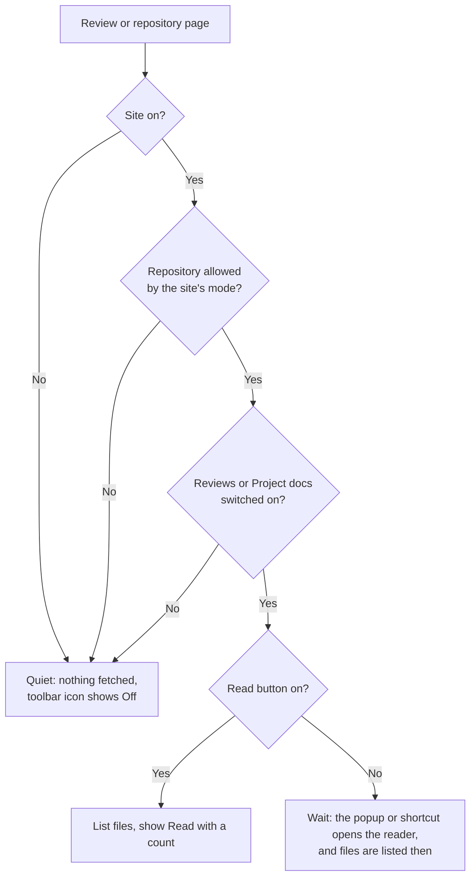

# RFC 0055: Choose where Galley runs, how it opens and which features it offers

## Problem

Galley is all or nothing on each site. Once installed, it runs on every pull request on github.com, every merge request on gitlab.com, and every self-hosted site the reviewer enabled. Three kinds of reviewer find that too blunt:

- **Reviewers who want Galley for some repositories only.** Someone who reads their team's design docs with Galley but browses open-source pull requests during the day sees a **Read** button everywhere. Others want it everywhere except one or two repositories: a monorepo whose generated docs they skip, or a project where the platform's diff is all they need. An organisation's security review may approve the extension for its own repositories and no others. The only finer control today is the browser's own site access, which works per site, not per repository, and lives in the browser's extension settings.
- **Reviewers who prefer the toolbar to a floating button.** The **Read** button sits over the bottom-right corner of every review page, on top of GitHub's and GitLab's own controls. × hides it for one page; it is back on the next. Some reviewers would rather open the reader from Galley's toolbar button or a keyboard shortcut, and never see a button on the page. The button also has a cost when it is ignored: to show its count, Galley lists the review's files as soon as a review page opens, which is three GitHub API requests per pull request out of the 60 an hour GitHub allows without a token ([user guide](../GUIDE.md#github-githubcom-and-enterprise-server)).
- **Reviewers who want fewer features.** Galley has grown: chapters ([RFC 0036](0036-review-chapters.md)), code files, test plans, resume, comments from the reader, and soon project docs on repository pages ([RFC 0049](0049-repository-docs-and-project-maps.md), [#54](https://github.com/m9rc1n/galley/pull/54)). Some already have a switch in **Settings → Review** (**Code files**, **Title & description**). Others do not: **Chapters** and its route appear in every review, the reader always offers to post comments, and reading positions are always saved. A reviewer who wants a quiet Markdown reader, or who must not post from a browser extension, has no way to say so.

The expected benefit, that reviewers keep Galley installed and use it where it helps instead of turning the whole extension off, is a hypothesis to validate.

## Proposal

Implementation has started with **How the reader opens**, the independent second part below: the page-button switch, toolbar actions and extension shortcut. Site/repository policy and feature switches remain proposed, including the privacy and default-setting questions at the end of this RFC. [Issue #55](https://github.com/m9rc1n/galley/issues/55) tracks progress.

The first implementation's browser captures: [toolbar before](../opening-popup-before.png), [toolbar after](../opening-popup-after.png), and the settings page at [desktop](../opening-settings-desktop.png) and [phone](../opening-settings-mobile.png) widths. The toolbar is shown on the same GitLab review; the new settings page has no earlier equivalent.

Three controls, each useful on its own. The defaults keep today's behaviour exactly: nothing changes for a reviewer who never opens them.

### 1. Where Galley runs

Choose per site, and within a site per owner, group or repository.

- **Sites.** github.com, gitlab.com and each enabled self-hosted site can be **On** or **Off**.
- **Repositories.** Each site has a mode:
  - **All repositories** (the default, and today's behaviour);
  - **All except the ones I turn off**;
  - **Only the ones I turn on**.
- **A rule names a repository** (`acme/api`, `group/subgroup/project`) **or everything under an owner or group** (`acme`, `group/subgroup`). Rules match whole path segments: `acme` covers `acme/api`, and on GitLab `acme/tools/cli`, but never `acme-labs`. GitHub paths compare without regard to case, as GitHub does. No wildcards or regular expressions in the first version.
- **Rules are made where the reviewer is, not typed.** On a review or repository page, the toolbar popup names the repository and offers **Turn off for acme/api**, **Turn off for everything in acme** and **Turn off on github.com**, and the matching **Turn on…** actions where Galley is off. The settings page lists every rule, with **Remove** beside each.
- **Off means off:** no Read button, no requests to the platform, nothing stored and no keyboard shortcuts on that page. On github.com and gitlab.com the browser still loads Galley's script, because the manifest declares it; the script reads the address and stops. Whether turning a whole site off should unregister the script is an open question.
- **The toolbar icon shows when Galley is off for the current page,** so a reviewer who wonders where the button went finds the reason in one click.

### 2. How the reader opens

- **Read button on the page: On** (the default) **or Off.** It covers **Read** on reviews, and **Read docs** on repository pages once RFC 0049 ships. × on the button keeps hiding it for one page, as today.
- With the button off, the reader opens from:
  - **the toolbar popup**, which puts **Read this review** first when the current tab is a review Galley can read (and **Read docs** on a repository page);
  - **a keyboard shortcut**, declared as an extension command so the reviewer can change it in the browser's shortcut settings.
- **With the button off, nothing is fetched until the reviewer asks.** The popup cannot say "3 documents" without listing files, so it names what the address tells it ("Pull request #12 in acme/api") and loads on **Read this review**. Failures that the button marks with **!** today appear in the reader, as they do when a failed button is clicked.

### 3. Which features Galley offers

A **Features** list of switches. A feature gets a switch when it adds a surface, makes a request, stores something or writes to the platform. How things look stays in the reader's **Settings**.

| Feature | Off means | Today |
| --- | --- | --- |
| **Reviews** (pull and merge requests) | No Read button and no reader on review pages; the popup and the shortcut do not offer it | Always on |
| **Project docs** (repository pages, RFC 0049) | No **Read docs** button, and no **Project docs** in the review reader | Not shipped |
| **Code files** | Only documents are read; code is never fetched | **Settings → Review → Code files** |
| **Title & description** | The request's own description is not shown as the first document | **Settings → Review → Title & description** |
| **Chapters** | No **Chapters** button, no <kbd>M</kbd>, no **Start here** route or **Next chapter**; the document menu and suggested order stay | Always on |
| **Comments** | **Read and write** (today) or **Read only**: threads still sit beside the text, but there is no **Comment** chip, **Add a comment…**, **Reply** or <kbd>R</kbd>, and nothing is ever posted | Always read and write |
| **Pick up where you left off** | No reading positions are saved and **Continue** never appears; **Forget saved places** clears the ones already saved | Always on |

**Code files** and **Title & description** appear in both places and stay one setting: change either copy and the other follows. Every new surface a later RFC proposes ships with a switch in this list, at a default that RFC argues for.

Feature switches apply everywhere in the first version. Per-repository features ("Code files only in acme/api") are a later step; rules are stored so that they can carry a feature set later without a migration.

### Where the controls live

- **The toolbar popup** is about the current page: on or off here, **Read this review**, and the existing self-hosted site and GitHub token sections.
- **A settings page** (the extension's options page, also reached from **Settings…** in the popup) holds **Sites and repositories**, **Opening the reader** and **Features**, with every rule listed.
- **The reader's Settings → Review** keeps its reading options and links to **Features and sites…**.

Changes reach open tabs without a reload. Turning Galley or a feature off **never closes an open reader or discards a draft**: the change applies the next time the reader opens.

## Proposed acceptance criteria

**Where Galley runs**

- [ ] After an update, with no choices made, Galley behaves exactly as before on every site and asks for nothing.
- [ ] On a review or repository page, the popup names the site and repository, and turns Galley off for the repository, its owner or group, or the whole site in one click each; each is undone from the same place.
- [ ] Where Galley is off, it shows no button, makes no request to the platform, stores nothing and handles no keys. Unit tests assert no fetch and no storage write.
- [ ] With **Only the ones I turn on**, unlisted repositories stay quiet and the popup offers **Turn on for…**.
- [ ] Rules match whole segments (`acme` never covers `acme-labs`), GitLab nested groups and sub-path installs, and GitHub paths in any case.
- [ ] The settings page lists every rule by site with **Remove**; with no rules, it explains how to add one from a page.
- [ ] When the rules cannot be read, Galley does not run on the page and the popup says why: a reviewer who chose **Only the ones I turn on** never sees Galley appear elsewhere because of a storage error.

**How the reader opens**

- [ ] With the Read button off, no button appears on reviews or repository pages, and nothing is fetched until the reviewer chooses **Read this review** or presses the shortcut.
- [ ] **Read this review** and the shortcut open the same reader as the button, including the retry after a failure.
- [ ] On a page Galley cannot read, or where it is off, the shortcut does nothing to the page and the popup says why.

**Features**

- [ ] Each switch removes the controls, shortcuts, requests and storage the table lists. The **Keys** tab lists only shortcuts that work.
- [ ] With **Comments: Read only**, no path in the reader reaches the platform's write APIs; tests cover the **Comment** chip, the comments column, replies and <kbd>R</kbd>.
- [ ] **Code files** and **Title & description** stay one setting, whichever place changes them.
- [ ] Turning off **Pick up where you left off** stops saving at once; **Forget saved places** clears `galley:positions` and says so.

**Everywhere**

- [ ] Changes reach open tabs within a second, without a reload; an open reader and its drafts are untouched until it closes.
- [ ] A storage failure keeps the previous choice and says the change was not saved.
- [ ] Keyboard, screen reader names (switches announce their state), phones (320 and 390 pixels for the settings page), dark appearance and reduced motion are verified.
- [ ] Focused unit tests and browser checks, including the demo; the 100% coverage gate stays intact.
- [ ] The user guide, PRIVACY.md, the storage inventory, COPY.md and the UI map describe the new controls.

## Privacy and data decisions

- **New: the reviewer's own rules.** The sites, owners, groups and repositories the reviewer turned on or off, in `chrome.storage.local` under a new key (proposed: `galley:sites`), until removed in the settings page or the extension is uninstalled. Never sent anywhere, and not synced between browsers.
- **The rules are readable names.** Galley stores no readable repository or review addresses today ([storage inventory](../architecture/storage.md#what-is-never-stored)); progress is kept as fingerprints ([ADR 0019](../adr/0019-review-progress-as-fingerprints.md)). The rules must be readable so the reviewer can see and edit them, and they record choices, not reading history. Before this ships it needs an ADR that says so, and updates to PRIVACY.md and the storage inventory. A fingerprint alternative is described below.
- **Opening and feature switches** join the existing `galley:settings` object: on/off values and choices, nothing that identifies a repository.
- **Fewer requests.** With the Read button off, Galley stops listing files on every review page it sees; where a repository is off, it makes no requests at all.
- **Saved positions** gain a way to stop saving and to clear what is saved.
- No telemetry about which features are used ([ADR 0002](../adr/0002-no-server-no-telemetry.md)).

## Alternatives and tradeoffs

- **Do nothing:** reviewers who want Galley for some repositories, or without the floating button, turn the whole extension off and on, or uninstall it.
- **Rely on the browser's site access** (Chrome's *On click* and *On specific sites*, Firefox's per-site permissions): already there and costs no code, but it works per site rather than per repository; *On click* hides the Read button until the toolbar icon is clicked on each page, without saying so; and it controls nothing inside the reader. The guide should explain it, not depend on it.
- **Store rules as fingerprints,** like Viewed progress: hashing each path prefix still lets Galley match `acme` or `acme/api` with nothing readable stored. But the settings page could only say "3 repositories and 1 group" with **Clear all**, and the reviewer could not see which. Stronger privacy, much weaker control; see Open questions.
- **Wildcards or regular expressions in rules:** more power, and more ways to turn Galley off by mistake. Whole-segment prefixes already cover owners and groups; revisit if reviewers ask.
- **A repository file chosen by authors** (for example `.galley.yml`): maintainers could set defaults for everyone, but authors would decide for reviewers, and reading the file costs a request per review. Out of scope.
- **Profiles** ("Work", "Open source"): flexible, but a second concept to learn before the first is proven.
- **Switches only in the reader's settings sheet:** close to the other settings, but a reviewer who turns off **Reviews** or the Read button could never reach them again. The popup and the settings page are reachable from anywhere.
- **The toolbar button opens the reader directly,** with no popup: one click instead of two, but the popup's site, token and on/off controls would need another home. Possible later, as an option.

## Open questions

- **Product, blocking:** readable rules or fingerprints? Recommendation: readable, local only, described in PRIVACY.md, with an ADR.
- **Product, blocking:** the default for new surfaces. Should **Project docs**, a Read docs button on every repository page, start on or off for reviewers updating from an earlier version?
- **Design, blocking:** does the popup stay calm with three turn-off actions and **Read this review**? How does the toolbar icon show "off here" (a muted icon, a badge, or both) in light and dark browser themes?
- **Engineering, blocking:** should **Off** for github.com or gitlab.com unregister the content script so it never loads? That means registering the built-in sites dynamically, as self-hosted sites already are (`src/platforms/sites.ts`), restoring them on install and update, and checking Firefox's behaviour.
- **Design, not blocking:** which default key for the shortcut, clear of the browsers' and the platforms' own shortcuts.
- **Engineering, not blocking:** a renamed or transferred repository keeps its old rule. GitLab pages carry a project ID (`data-project-id`) that survives renames; GitHub would need a request. Is the path enough?
- **Product, not blocking:** per-repository feature sets, and settings an organisation manages through the browser's managed storage (`storage.managed_schema`, no new permission) for teams that approve Galley for their own repositories only.
- **Product, not blocking:** export and import of settings, and sync between the reviewer's browsers, which would hand the rules to the browser vendor's account sync.

## Validation

Sessions with five to eight reviewers on real reviews: at least two who mix work and open-source repositories, and one person who approves browser extensions for a team. Tasks:

1. Make Galley appear only on your team's repositories.
2. You turned Galley off for a repository yesterday. Open a review there and get Galley back.
3. Turn off the Read button, then open a review from the toolbar, and again with the shortcut.
4. Turn off chapters, then set comments to read only, and say what still works.

Watch whether reviewers predict what **Off** means (does Galley still read anything?), whether they find Galley again after turning it off, and whether the popup stays easy to scan. Compare with what they do today: the browser's site access, or turning the extension off. Research sessions only; Galley has no telemetry.

## Sequencing

1. **Where Galley runs:** site and repository on/off from the popup, the three modes, and the list in the settings page. The smallest useful slice is **Turn off for this repository** plus **Only the ones I turn on**.
2. **How the reader opens:** the Read button switch, **Read this review** in the popup and the shortcut. Independent of part 1, and could ship first.
3. **Features:** Reviews, Chapters, Comments read only and Pick up where you left off, with Code files and Title & description mirrored. Project docs joins when RFC 0049 ships.
4. **Later:** per-repository features, managed settings, export and import.

Builds on the self-hosted site controls in the popup (`src/platforms/sites.ts`) and the settings model (`src/ui/settings.ts`). Unblocks every later RFC that adds a surface: each ships with a switch here.

## Related RFCs

- [RFC 0049](0049-repository-docs-and-project-maps.md) — adds **Read docs** on repository pages, the largest new surface a reviewer might want off, and the first to need a new-surface default.
- [RFC 0036](0036-review-chapters.md) — chapters get a switch; the document menu and suggested order stay when they are off.
- [RFC 0038](0038-pause-and-resume.md) — builds on saved positions, which this RFC lets a reviewer turn off and clear.
- [RFC 0048](0048-personal-review-inbox.md) — an inbox would list reviews only from repositories where Galley is on.
