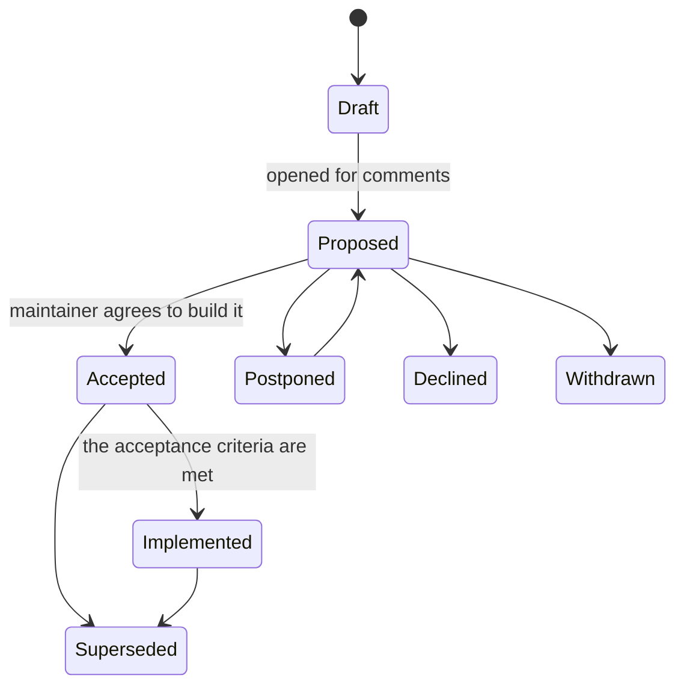
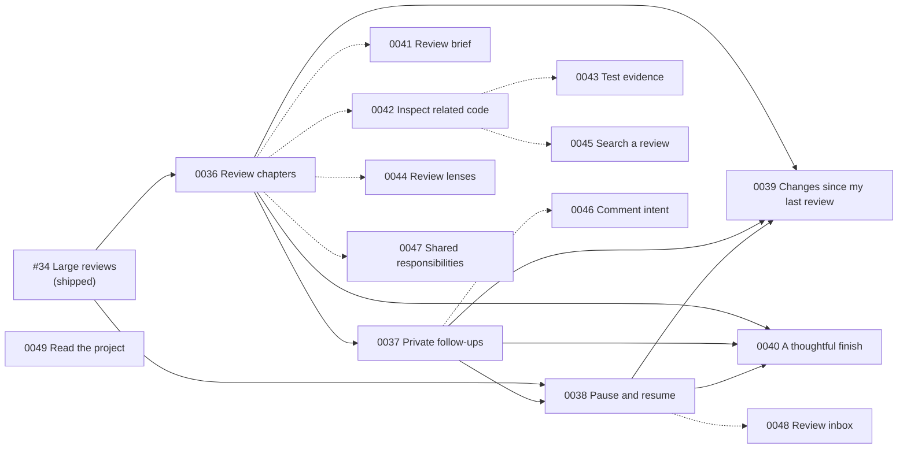

# Requests for comments (RFCs)

An RFC proposes a change that deserves discussion before anyone builds it: a new review surface, a change to what Galley stores or sends, a new permission, or a different way through a review. RFCs say what problem a reviewer has, what we might do about it, and how we will find out whether it helped.

Decisions are recorded separately, as [architecture decision records](../adr/README.md). The two are linked both ways: an RFC lists the ADRs that record, constrain or would be revisited by it (`adrs:`), and each ADR lists the RFCs behind it (`rfcs:`). `npm run docs:check` fails when a link goes only one way.

## When to write one

| Write an RFC | Skip it |
| --- | --- |
| A new surface or workflow in the reader, popup or site | Bug fixes, polish and copy edits |
| Anything that changes what is stored, for how long, or what leaves the browser | Refactors with no visible change |
| A new permission, host or platform API | A new palette, typeface or shortcut that fits an existing setting |
| Work that spans several pull requests or needs research with reviewers | Changes covered by an accepted RFC or ADR |

If you are unsure, open the issue first: a short RFC is cheaper than a long pull request.

## Lifecycle



| Status | Meaning |
| --- | --- |
| Draft | Being written; not ready for comments. |
| Proposed | Open for comments. Nothing is promised. |
| Accepted | Agreed. Work may be under way; `progress:` says what is done and what is open. |
| Implemented | The acceptance criteria are met; `implemented-in:` links the pull requests. |
| Postponed | A good idea for later; the open questions say what would bring it back. |
| Declined | We decided not to do it. The RFC stays, with the reasoning, so the question is not reopened blind. |
| Withdrawn | The author stopped pursuing it. |
| Superseded | Replaced by another RFC, named in the text. |

## How it works

1. **Open the discussion.** Create an issue titled `RFC: <what the reviewer gets>`, labelled `enhancement` and `question`. The issue number becomes the RFC number, so RFC 0037 is discussed in issue #37.
2. **Add the text.** Copy [template.md](template.md) to `docs/rfcs/NNNN-short-title.md` (four digits, the issue number) and open a pull request. Link the file from the issue. From then on the file is the proposal: edits go through pull requests, and Galley is a good way to review them.
3. **Discuss.** Comments go on the issue, or beside the text in the pull request.
4. **Decide.** The maintainer sets `status:`. When the decision shapes the architecture, write an [ADR](../adr/README.md) that cites the RFC in `rfcs:` and add it to the RFC's `adrs:`.
5. **Build.** Implementation pull requests say `Refs #NNNN`. Keep `progress:` current while the work spans several pull requests; when the acceptance criteria are met, set `Implemented` and list the pull requests in `implemented-in:`.
6. **Index.** Run `npm run docs:index` to refresh the table below, and `npm run docs:check` before pushing (`npm run check` includes it).

### Front matter

```yaml
---
status: Proposed                 # see the table above
created: 2026-10-10              # YYYY-MM-DD
authors: [m9rc1n]
discussion: https://github.com/m9rc1n/galley/issues/37
theme: Never lose the thread     # the initiative it belongs to
phase: Core, 2 of 3              # optional: where it sits in the theme
progress: …                      # optional, while Accepted
implemented-in: [https://github.com/m9rc1n/galley/pull/50]   # optional
adrs: [2, 19]                    # decisions it relies on or would revisit
---
```

Front matter values are plain YAML: avoid ` #` inside a value, which YAML reads as a comment.

## What a good Galley RFC does

The RFCs below share a shape and a few habits worth keeping:

- **Start from the reviewer's problem**, in their words, and say what Galley already does about it.
- **Treat benefits as hypotheses.** Say how they will be validated: sessions with five to eight reviewers on real reviews, compared with today's experience. Galley has no telemetry ([ADR 0002](../adr/0002-no-server-no-telemetry.md)), and an RFC never proposes adding it.
- **Keep the reviewer in charge.** Nothing is posted, marked Viewed, approved or inferred without an explicit action. Facts recorded by Galley stay distinct from claims about understanding or correctness.
- **Make data decisions explicit.** Anything new that is stored, synced or sent needs a storage, retention and clearing policy, and a PRIVACY.md update, before it ships.
- **Write acceptance criteria a reviewer could check**, including failure states, keyboard and screen reader use, phones, reduced motion, and the 100% coverage gate.
- **Name the alternatives** and what each would cost, and keep open questions tagged by who must answer them (product, design, engineering) and whether they block.

## Index

Generated from the RFC files by `npm run docs:index`; do not edit by hand.

<!-- rfc-index:start -->
| RFC | Proposal | Status | Theme | Discussion | ADRs |
| --- | --- | --- | --- | --- | --- |
| [0036](0036-review-chapters.md) | Review chapters with a clear starting point | Accepted | Never lose the thread | [#36](https://github.com/m9rc1n/galley/issues/36) | [0021](../adr/0021-suggested-order-and-folded-files.md), [0022](../adr/0022-review-chapters-from-evidence.md) |
| [0037](0037-private-follow-ups.md) | Private follow-ups for review questions | Proposed | Never lose the thread | [#37](https://github.com/m9rc1n/galley/issues/37) | [0002](../adr/0002-no-server-no-telemetry.md), [0019](../adr/0019-review-progress-as-fingerprints.md) |
| [0038](0038-pause-and-resume.md) | Pause and resume the reviewer's train of thought | Proposed | Never lose the thread | [#38](https://github.com/m9rc1n/galley/issues/38) | [0019](../adr/0019-review-progress-as-fingerprints.md) |
| [0039](0039-changes-since-last-review.md) | Show what changed since my last review | Proposed | Never lose the thread | [#39](https://github.com/m9rc1n/galley/issues/39) | [0019](../adr/0019-review-progress-as-fingerprints.md) |
| [0040](0040-thoughtful-finish.md) | A thoughtful finish for a review | Proposed | Never lose the thread | [#40](https://github.com/m9rc1n/galley/issues/40) | [0008](../adr/0008-comment-through-platform-review-apis.md), [0021](../adr/0021-suggested-order-and-folded-files.md) |
| [0041](0041-review-brief.md) | A review brief that explains intent and constraints | Proposed | Never lose the thread | [#41](https://github.com/m9rc1n/galley/issues/41) | — |
| [0042](0042-inspect-related-code.md) | Inspect related code without losing your place | Proposed | Never lose the thread | [#42](https://github.com/m9rc1n/galley/issues/42) | [0002](../adr/0002-no-server-no-telemetry.md), [0020](../adr/0020-read-code-statically.md) |
| [0043](0043-test-evidence.md) | Connect changed behavior to test evidence | Proposed | Never lose the thread | [#43](https://github.com/m9rc1n/galley/issues/43) | [0020](../adr/0020-read-code-statically.md) |
| [0044](0044-review-lenses.md) | Review lenses for focused passes through a change | Proposed | Never lose the thread | [#44](https://github.com/m9rc1n/galley/issues/44) | — |
| [0045](0045-search-across-a-review.md) | Search across a review, including folded content | Proposed | Never lose the thread | [#45](https://github.com/m9rc1n/galley/issues/45) | [0002](../adr/0002-no-server-no-telemetry.md), [0021](../adr/0021-suggested-order-and-folded-files.md) |
| [0046](0046-comment-intent-and-severity.md) | Comment drafts that make intent and severity clear | Proposed | Never lose the thread | [#46](https://github.com/m9rc1n/galley/issues/46) | [0008](../adr/0008-comment-through-platform-review-apis.md) |
| [0047](0047-shared-review-responsibilities.md) | Shared review responsibilities and explicit handoffs | Proposed | Never lose the thread | [#47](https://github.com/m9rc1n/galley/issues/47) | [0002](../adr/0002-no-server-no-telemetry.md), [0008](../adr/0008-comment-through-platform-review-apis.md) |
| [0048](0048-personal-review-inbox.md) | A personal review inbox for deliberate workload planning | Proposed | Never lose the thread | [#48](https://github.com/m9rc1n/galley/issues/48) | [0002](../adr/0002-no-server-no-telemetry.md), [0019](../adr/0019-review-progress-as-fingerprints.md) |
| [0049](0049-repository-docs-and-project-maps.md) | Repository docs reading, project maps and architecture exploration | Proposed | Read the project, understand the change | [#49](https://github.com/m9rc1n/galley/issues/49) | [0001](../adr/0001-record-decisions-and-proposals.md), [0009](../adr/0009-github-tokens-in-the-background-worker.md), [0011](../adr/0011-sandbox-third-party-engines.md), [0019](../adr/0019-review-progress-as-fingerprints.md) |
<!-- rfc-index:end -->

## How the current RFCs fit together



Solid arrows are the sequencing the RFCs state; dotted ones are the exploratory follow-ups and the RFC each builds on most. **Never lose the thread** has three core RFCs (0036 to 0038), two planned follow-ups (0039, 0040) and eight exploratory ones (0041 to 0048). **Read the project, understand the change** (0049) is a separate initiative; Galley's own `docs/` folder, with its linked ADRs and RFCs, is meant to be one of its test repositories.
